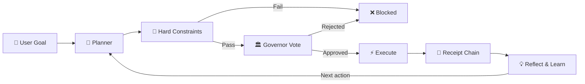

# 🧠 AgentBigBrain — Governed Autonomous AI Agent (Assistant)


**A governed cognitive architecture for autonomous AI agents — where every action is constrained, governed, executed, and cryptographically receipted.**

[](https://github.com/AgentBigBrain/AgentBigBrain/actions/workflows/ci.yml)
[](./LICENSE)
[](./tsconfig.json)
[](#zero-dependency-core)

AgentBigBrain is not another LLM wrapper or prompt chain. It is a **defensively engineered cognitive runtime** for building AI agents that plan, execute, learn, and operate autonomously. The system abandons the typical "loose loop" of standard agent frameworks in favor of a **rigidly typed, fail-closed runtime**, where every action passes through non-negotiable hard constraints, a two-path governance layer (security-only fast path, or full 7-governor council escalation), execution limits, and finally a tamper-evident cryptographic receipt chain.

Built in TypeScript with only **2 runtime dependencies** (`ws`, `onnxruntime-node`). Everything else — HTTP servers, crypto, process management, persistence — uses Node.js built-ins by design.

Architecture spec: **[docs/ARCHITECTURE.md](docs/ARCHITECTURE.md)**.
Operator troubleshooting map: **[docs/ERROR_CODE_ENV_MAP.md](docs/ERROR_CODE_ENV_MAP.md)**.

---

## Key Features

🏛️ **Governor Council** — Actions follow two governance paths: **fast-path** actions are evaluated by the security governor alone, while **escalation-path** actions go to the full 7-governor council (ethics, logic, resource, security, continuity, utility, compliance) with supermajority voting. A separate code-review governor runs as a preflight gate for skill creation.

🔒 **Hard Constraints (Fail-Closed by Design)** — A pre-governance safety boundary that runs *before* voting. If the LLM hallucinates an off-limits `child_process` command or attempts to manipulate immutable files, the runtime does not endlessly prompt the LLM to fix it. It throws a structural block, logs a typed block outcome and denies that action. (Malformed model outputs are caught even earlier at the rigid schema-validation boundary.)

🔗 **Tamper-Evident Execution Receipts** — AgentBigBrain operates on mathematical proof of behavior. Every approved action produces a cryptographic receipt after execution, containing output digests, vote digests, and a hash-chained link to prior receipts. You don't have to trust the agent; you can verify the full chain for tampering at any time.

🧠 **Five Memory Systems** — Profile memory (encrypted, approval-gated), governance memory (append-only decision ledger), semantic memory (ONNX vector embeddings), workflow learning (pattern-scored planner hints), and an entity relationship graph. Memory access has probing/extraction attack detection with sliding-window analysis.

🌐 **Multi-Interface Runtime** — CLI (single task, autonomous loop, daemon), Telegram bot, Discord bot, and an authenticated HTTP federation protocol for agent-to-agent task delegation.


<a id="zero-dependency-core"></a>
📦 **Zero-Dependency Core** — The entire framework runs on 2 runtime packages. No LangChain, no heavyweight SDKs, no implicit trust in third-party code. Crypto, HTTP, SQLite, and process control all use Node.js built-ins.

---

## How It Works

Every task follows the same governed execution loop:



1. **Plan** — The `PlannerOrgan` calls the LLM, synthesizing workflow learning hints and judgment patterns out of past runs, and forces the model to return a strictly typed `PlannerModelOutput` schema. A `FirstPrinciplesPacketV1` is generated deterministically alongside the plan when triggered.
2. **Constrain** — `hardConstraints.ts` enforces non-negotiable safety rules *before* governance. Sandbox escapes, unsafe code patterns, cost overruns, and immutable-file mutations are definitively blocked here.
3. **Vote** — Fast-path actions are evaluated by the security governor; escalation-path actions go to the full 7-governor council with supermajority voting.
4. **Execute** — The `ToolExecutorOrgan` runs the approved action and returns a typed execution outcome (`success | blocked | failed` + deterministic failure code). `TaskRunner` fail-closes non-success outcomes before receipt append. Shell commands run with output buffering, timeout enforcement, and telemetry; file operations use direct FS access with protected-path checks. `read_file` returns a bounded preview payload (with deterministic truncation metadata) instead of unbounded full-file output. Skill artifacts are written as `runtime/skills/<name>.js` (primary runtime artifact) with `.ts` compatibility artifacts during migration, and `run_skill` resolves `.js` first then `.ts`.
5. **Receipt** — After execution, a tamper-evident `ExecutionReceipt` is appended to a hash chain with digests of the output, votes, and metadata (approved actions only).
6. **Reflect** — The `ReflectionOrgan` analyzes outcomes, extracts lessons, classifies signal quality, and persists high-value learnings to memory.

---

## What Makes This Different

| | Other Agent Frameworks | AgentBigBrain |
|---|---|---|
| Governance | Optional middleware | **Governance *is* the architecture** — there is no bypass path |
| Safety model | Trust the model to self-govern | **Deterministic classifiers run first**; the model is a fallback, not the safety layer |
| Audit trail | Logs are afterthoughts | **Every approved action has a cryptographic receipt** chained to every prior receipt |
| Memory | Retrieval-focused stores | **Five governed memory systems** with probing detection, encryption, and approval gates |
| Dependencies | Dozens of npm packages | **2 runtime dependencies**, everything else is Node.js built-ins |
| Default posture | "Add safety later" | **Fail-closed by default** — missing config, failed checks, or governance timeouts all result in action denial |

---

## Evolutionary Maturity Stages

AgentBigBrain does not grant blanket autonomy. It unlocks capabilities through strict, version-gated evolutionary stages based on proven, auditable milestones. 

The codebase contains an architectural fossil record (e.g., `stage6_75ApprovalPolicy.ts`, `stage6_86ConversationStack.ts`) indicating progressive scaling:
- **Stage 6.75:** Unlocks robust user-facing approvals and preflight consistency checks.
- **Stage 6.85:** Grants bounded mission-recovery logic, clones, and workflow replay.
- **Stage 6.86:** Implements multi-turn conversation stacks, open-loop bindings, and global mission suppression limits.

Each stage is accompanied by a suite of deterministic live-smoke scripts, ensuring the runtime is capable of handling the new complexity safely before scaling further.

---

## Clones (Not Sub-Agents)

AgentBigBrain includes a **satellite clone model** for bounded parallelism.

A clone is **not** an autonomous sub-agent with independent tool authority running a rogue system process.
A clone is a short-lived, deterministic satellite identity (for example `[atlas-1001]`) with a bounded role overlay (`creative`, `researcher`, `critic`, `builder`) that remains strictly controlled by the Orchestrator. 

This prevents the "blast radius" of parallel tasks from expanding beyond the main agent's established constraints.

What this means in practice:

- Deterministic spawn controls: clone count, depth, and budget are hard-limited.
- Isolation by design: direct clone-to-clone channels are denied; relay must go through orchestrator flow.
- Merge governance: clone outputs must pass merge eligibility and governance checks before integration.
- Auditability: rejected merges are ledgered with reason/governor attribution; approved merges preserve `committedByAgentId`.

Scope clarification:

- Sub-agent limits (`BRAIN_MAX_SUBAGENTS_PER_TASK`, `BRAIN_MAX_SUBAGENT_DEPTH`) are the resource envelope.
- Clones are the concrete governed satellite mechanism inside that envelope.
- Current production wiring uses clone-governed merge attribution in reflection/distiller paths; clone workflow spawn/packet policies are implemented and validated through stage evidence tooling.

---

## Quickstart

Need the **full** operator setup path? See **[docs/SETUP.md](docs/SETUP.md)**.

```bash
npm install
npm run build
npm test
npm run check:docs
npm run dev -- "summarize current repo status"
```

## Detailed Setup

### 1) Prerequisites

- **Node.js 22.x** or later (requires `node:sqlite` and global `fetch`).
- **npm** (this repository uses `package-lock.json`).

### 2) Install

```bash
npm install
```

### 3) Install local ONNX embedding assets (recommended)

Semantic memory uses a local ONNX model (`all-MiniLM-L6-v2`) and tokenizer files.
Install them once:

```bash
npm run setup:embeddings
```

PowerShell (same command):

```powershell
npm run setup:embeddings
```

Optional flags:

```bash
npm run setup:embeddings -- --dir models/all-MiniLM-L6-v2 --force
```

If you intentionally skip local embeddings, set:

```env
BRAIN_ENABLE_EMBEDDINGS=false
```

### 4) Configure environment

Runtime env loading is implemented in `src/core/envLoader.ts`.

- By default, startup loads `.env` and then `.env.local`.
- Set `BRAIN_DISABLE_DOTENV=true` to disable file-based loading.
- Loading is non-destructive: if a key is already in `process.env`, file values do not overwrite it.

Create your local env file from the template:

```bash
cp .env.example .env
```

On PowerShell:

```powershell
Copy-Item .env.example .env
```

Then replace placeholder secrets in `.env` (for example `OPENAI_API_KEY`, interface secrets, and bot tokens) as needed for your runtime mode.

If you are enabling Telegram or Discord, use **[docs/SETUP.md](docs/SETUP.md)** for the value-to-source mapping before you fill the interface vars. It now shows where to get:

- `BRAIN_INTERFACE_ALLOWED_USERNAMES`
- `BRAIN_INTERFACE_ALLOWED_USER_IDS`
- `TELEGRAM_ALLOWED_CHAT_IDS`
- `DISCORD_ALLOWED_CHANNEL_IDS`

Practical bring-up rule:

- Start with usernames plus bot token(s).
- Leave `BRAIN_INTERFACE_ALLOWED_USER_IDS` and chat/channel allowlists blank until the bot responds once.
- Add the stricter ID/chat/channel allowlists after initial verification.

Minimal local config for non-provider runs:

```env
BRAIN_MODEL_BACKEND=mock
BRAIN_RUNTIME_MODE=isolated
```

### 5) Build and run

```bash
npm run build
npm run dev -- "<goal>"
```

### 6) Runtime modes

```bash
npm run dev -- "<goal>"
npm run dev -- --autonomous "<goal>"
npm run dev -- --daemon "<goal>"
npm run dev:interface
npm run dev:federation
```

`--daemon` is fail-closed and requires:

- `BRAIN_ALLOW_DAEMON_MODE=true`
- `BRAIN_MAX_AUTONOMOUS_ITERATIONS > 0`
- `BRAIN_MAX_DAEMON_GOAL_ROLLOVERS > 0`

Autonomous execution semantics:

- For execution-style goals, `Goal Met` is only allowed after at least one approved real side-effect action occurs in the current mission.
- Read-only actions (`read_file`, `list_directory`) and simulated outcomes do not count as completion evidence for execution-style missions.
- For goals with explicit target paths, completion is gated on path-touch evidence: at least one approved real side effect must touch the requested path. Path drift triggers typed defer reasons (`AUTONOMOUS_EXECUTION_STYLE_TARGET_PATH_EVIDENCE_REQUIRED`).
- For customization-heavy goals (for example theme/UI/component/style changes), completion is gated on mutation evidence from explicit typed mutation actions (`write_file`, `delete_file`, `self_modify`, `memory_mutation`, `network_write`, `create_skill`, `run_skill`). Shell-command text alone is intentionally excluded from mutation proof (`AUTONOMOUS_EXECUTION_STYLE_MUTATION_EVIDENCE_REQUIRED`).
- Repeated respond-only execution-style iterations trigger bounded deterministic abort (`reasonCode=AUTONOMOUS_EXECUTION_STYLE_STALLED_NO_SIDE_EFFECT`) instead of silently looping until cap.
- `BRAIN_AUTONOMOUS_MAX_CONSECUTIVE_NO_PROGRESS` controls the stall-abort threshold (`3` by default).
- Iteration runtime failures (for example provider timeout during a loop step) now terminate with deterministic stopped-state reason codes instead of ambiguous generic failure text (`AUTONOMOUS_TASK_EXECUTION_FAILED` in-loop, `AUTONOMOUS_LOOP_RUNTIME_ERROR` adapter fallback).

Routing semantics for build requests:

- Generic execution-style build prompts (for example: `create a React app on my Desktop and execute now`) map to the build execution surface and deterministic no-op fallback policy when no governed side effect executes.
- Explanation-only prompts (for example: `how do I create a React app`) are not over-classified as execution requests.

## Commands

### Install / Build / Test

```bash
npm install
npm run setup:embeddings
npm run build
npm test
npm run test:list
npm run test:watch
npm run test:coverage
npm run check:docs
```

### Runtime

```bash
npm run dev -- "<goal>"
npm run dev -- --autonomous "<goal>"
npm run dev -- --daemon "<goal>"
npm start -- "<goal>"
npm run dev:interface
npm run dev:federation
npm run start:federation
```

### Evidence and audits (selected)

```bash
npm run test:runtime_wiring:integrated_live_smoke
npm run test:runtime:orphan_gate
npm run test:runtime:orphan_gate:touched
npm run test:federation:live_smoke
npm run test:daemon:live_smoke
npm run test:interface:advanced_live_smoke
npm run test:interface:real_provider_live_smoke
npm run audit:claims
npm run audit:governors
npm run audit:ledgers
npm run audit:traces
```

### Build/Release status

- Build command: `npm run build`
- Release automation command: Not found in `package.json`
- Package publish status: `package.json` currently sets `"private": true`

## Architecture Overview

The system is organized into distinct layers, each with a clear responsibility:

| Layer | Directory | What It Does |
|---|---|---|
| **Core** | `src/core/` | Orchestrator, task runner, hard constraints, config, persistence stores, autonomous loop, execution receipts, agent identity |
| **Organs** | `src/organs/` | Cognitive modules — planner (1,123 lines), executor (749 lines), reflection (464 lines), memory broker (1,064 lines), intent interpreter (334 lines), and classifiers |
| **Governors** | `src/governors/` | 7 council governors with supermajority voting via `voteGate.ts`, a code-review preflight gate, and the master governor aggregation layer |
| **Models** | `src/models/` | Provider adapters behind `ModelClient` interface — OpenAI, Ollama, and a deterministic mock (21KB) for testing with schema validation |
| **Interfaces** | `src/interfaces/` | Telegram adapter/gateway, Discord adapter/gateway, conversation manager, session store, federation HTTP server/client, agent pulse scheduler |
| **Tools** | `src/tools/` | Utility and evidence tooling |
| **Tests** | `tests/` | ~118 test files covering every stage of the maturity model |
| **Evidence** | `scripts/evidence/` | ~59 evidence scripts producing auditable proof of functionality per stage |

**Entry point:** `src/index.ts` — CLI dispatcher supporting `task`, `--autonomous`, and `--daemon` modes.

**Composition root:** `src/core/buildBrain.ts` — Constructs the full `BrainOrchestrator` via dependency injection with zero global state.

Full architecture specification (source of truth):

- **[docs/ARCHITECTURE.md](docs/ARCHITECTURE.md)**

## Examples

### CLI (three common commands)

```bash
# 1) Single governed task
npm run dev -- "summarize current repo status"

# 2) Bounded autonomous loop
npm run dev -- --autonomous "stabilize runtime wiring plan execution"

# 3) Daemon mode (requires daemon latches in env)
npm run dev -- --daemon "continuously triage repository issues"
```

### `/help`-style interface examples (Telegram/Discord)

When you run `npm run dev:interface`, use `/help` in Telegram or Discord. The examples below mirror the current help text: command list, skill workflow, and the execution-state language you should expect back from the runtime.

When to use which command:

- **`/chat`**: use this for one direct request, a question, a summary, a skill create/run request, or a single side-effect request you want handled now.
- **`/propose`**: use this when you want a draft first and explicit approval before execution, especially for writes, shell commands, or larger multi-file changes.
- **`/auto`**: use this for a multi-step goal where the runtime may need several iterations to finish. If you expect real execution, still say **`execute now`** and name the shell when relevant.
- Autonomous progress updates are transport-aware: gateways prefer updating one progress message in place when the provider transport supports edit/stream behavior.
- **`/draft`**: use this to inspect the current proposed plan before approval.
- **`/adjust`**: use this to change the active draft without restarting from scratch.
- **`/approve`**: use this when the draft is correct and you want it executed.
- **`/cancel`**: use this when the active draft is wrong, stale, or no longer needed.

What the runtime will tell you:

- **Executed**: real side-effect actions actually ran in this run (read-only and simulated outcomes do not count).
- **Guidance only**: the run produced instructions or analysis without side effects.
- **Blocked**: safety, governance, or runtime policy denied execution in this run.

- Guidance only:
  `/chat guidance only: show me how to create a React app without executing anything`
  Why this succeeds: **`guidance only`** and **`without executing anything`** make it clear you want explanation, not side effects.

- Draft first, approval later:
  `/propose create a React app at C:\Users\<you>\Desktop\finance-dashboard. Show the exact approval diff before any write or shell command.`
  Why this succeeds: **`/propose`** keeps the request in draft form, and **`before any write or shell command`** makes the approval-first expectation explicit.

- Draft lifecycle:
  `/draft`
  `/adjust add a watchlist panel and show the exact approval diff before writes`
  `/approve`
  Why this succeeds: **`/draft`** shows the active draft, **`/adjust`** changes the pending plan without executing it, and **`/approve`** is the explicit execution boundary.

- Cancel the current draft:
  `/cancel`
  Why this succeeds: it deterministically clears the active draft instead of leaving stale approval state around.

- Create a skill:
  `/chat create skill repo_status that reads package.json and runtime/state.json and returns a short repo summary`
  Why this succeeds: there is **no separate `/skill` command** right now; skill creation goes through **`/chat`** or **`/propose`**.

- Run a skill:
  `/chat run skill repo_status on this repo`
  Why this succeeds: **`run skill <name>`** is the phrasing the planner can route without inventing a new slash-command surface.

- Autonomous build with real execution intent:
  `/auto create a React app at C:\Users\<you>\Desktop\finance-dashboard. Execute now using PowerShell. Create files directly; if blocked, stop and tell me exactly why.`
  Why this succeeds: **`Execute now`** makes side effects explicit, and **`PowerShell`** satisfies the current explicit-shell guardrail.

- Pulse controls:
  `/pulse on`
  `/pulse status`
  Why this succeeds: these are deterministic slash-command controls for Agent Pulse, not planner-generated free-form prompts.

- Deterministic command surfaces:
  `/status`
  `/review 6.85.A`
  Why this succeeds: these are direct slash-command surfaces with deterministic handlers.

Need more examples? See **[docs/COMMAND_EXAMPLES.md](docs/COMMAND_EXAMPLES.md)** for Telegram/Discord slash commands, CLI examples, approval-flow sequences, pulse commands, and prompt rewrites that make execution intent explicit.

Operator-facing execution states:

- `Executed`: approved real side-effect actions actually ran in this run (read-only and simulated outcomes do not count).
- `Guidance only`: response contains instructions or analysis only.
- `Blocked`: policy/governance/runtime denied execution; reply includes plain-English happened/why/next-step guidance.

### Federation API (HTTP)

Start federation runtime (requires `BRAIN_ENABLE_FEDERATION_RUNTIME=true` and valid `BRAIN_FEDERATION_CONTRACTS_JSON` in env):

```bash
npm run dev:federation
```

Health check:

```bash
curl -sS http://127.0.0.1:9100/federation/health
```

Submit delegated task:

```bash
curl -sS -X POST http://127.0.0.1:9100/federation/delegate \
  -H "Content-Type: application/json" \
  -H "x-federation-agent-id: partner_agent" \
  -H "x-federation-shared-secret: <shared_secret>" \
  -d '{"quoteId":"q-001","quotedCostUsd":1.25,"goal":"Summarize runtime status","userInput":"Summarize runtime status"}'
```

Poll result:

```bash
curl -sS http://127.0.0.1:9100/federation/results/<task_id> \
  -H "x-federation-agent-id: partner_agent" \
  -H "x-federation-shared-secret: <shared_secret>"
```

## Configuration

All configuration is via environment variables. Required variables are noted per-section. See `.env.example` for a complete template.

<details>
<summary><strong>Core Runtime & Safety</strong></summary>

| Name | Required | Default | Description |
|---|---|---|---|
| `BRAIN_DISABLE_DOTENV` | No | `false` | Skip `.env` and `.env.local` loading when truthy. |
| `BRAIN_RUNTIME_MODE` | No | `isolated` | Runtime profile: `isolated` or `full_access`. |
| `BRAIN_ALLOW_FULL_ACCESS` | Conditional | `false` | Required when `BRAIN_RUNTIME_MODE=full_access`. |
| `BRAIN_ENABLE_REAL_SHELL` | No | `false` | Enables real shell execution path. |
| `BRAIN_ENABLE_REAL_NETWORK_WRITE` | No | `false` | Enables real network-write action path. |
| `BRAIN_ALLOW_DAEMON_MODE` | Conditional | `false` | Required for `--daemon` mode startup. |
| `BRAIN_MAX_AUTONOMOUS_ITERATIONS` | No | `15` | Max iterations per autonomous run. |
| `BRAIN_AUTONOMOUS_MAX_CONSECUTIVE_NO_PROGRESS` | No | `3` | Stall guard: max consecutive zero-progress autonomous iterations before abort. |
| `BRAIN_PER_TURN_DEADLINE_MS` | No | `20000` | Per-task action-loop deadline; once exceeded, pending actions block with `GLOBAL_DEADLINE_EXCEEDED`. |
| `BRAIN_MAX_DAEMON_GOAL_ROLLOVERS` | No | `0` | Max daemon rollover count; daemon requires `> 0`. |
| `BRAIN_USER_PROTECTED_PATHS` | No | empty | Semicolon-delimited extra protected path prefixes. |
| `BRAIN_REFLECT_ON_SUCCESS` | No | `false` | Enables success-path reflection storage. |
| `BRAIN_ALLOW_AUTONOMOUS_VIA_INTERFACE` | No | `false` | Allows autonomous behavior from interface commands. |

</details>

<details>
<summary><strong>Budget & Planning Limits</strong></summary>

| Name | Required | Default | Description |
|---|---|---|---|
| `BRAIN_MAX_ACTION_COST_USD` | No | `1.25` | Per-action estimated cost cap. |
| `BRAIN_MAX_CUMULATIVE_COST_USD` | No | `10` | Cumulative per-task estimated action-cost cap. |
| `BRAIN_MAX_MODEL_SPEND_USD` | No | `10` | Cumulative per-task model spend cap. |
| `BRAIN_MAX_SUBAGENTS_PER_TASK` | No | `2` | Max subagents/clones per task. |
| `BRAIN_MAX_SUBAGENT_DEPTH` | No | `1` | Max subagent delegation depth. |

</details>

<details>
<summary><strong>Model Backend</strong></summary>

| Name | Required | Default | Description |
|---|---|---|---|
| `BRAIN_MODEL_BACKEND` | No | `mock` | Backend selector: `mock`, `openai`, or `ollama`. |
| `OPENAI_API_KEY` | Conditional | none | Required when `BRAIN_MODEL_BACKEND=openai`. |
| `OPENAI_BASE_URL` | No | `https://api.openai.com/v1` | OpenAI API base override. |
| `OPENAI_TIMEOUT_MS` | No | `15000` | OpenAI request timeout (ms). |
| `OLLAMA_BASE_URL` | No | `http://localhost:11434` | Ollama API base URL. |
| `OLLAMA_TIMEOUT_MS` | No | `60000` | Ollama request timeout (ms). |

**OpenAI model alias overrides:**

| Name | Required | Default | Description |
|---|---|---|---|
| `OPENAI_MODEL_SMALL_FAST` | No | `gpt-4o-mini` fallback | Provider model for `small-fast-model`. |
| `OPENAI_MODEL_SMALL_POLICY` | No | `gpt-4o-mini` fallback | Provider model for `small-policy-model`. |
| `OPENAI_MODEL_MEDIUM_GENERAL` | No | `gpt-4o-mini` fallback | Provider model for `medium-general-model`. |
| `OPENAI_MODEL_MEDIUM_POLICY` | No | `gpt-4o-mini` fallback | Provider model for `medium-policy-model`. |
| `OPENAI_MODEL_LARGE_REASONING` | No | `gpt-4o-mini` fallback | Provider model for `large-reasoning-model`. |

**OpenAI pricing (usage estimation):**

| Name | Required | Default | Description |
|---|---|---|---|
| `OPENAI_PRICE_INPUT_PER_1M_USD` | No | `0` | Default input-token price estimate. |
| `OPENAI_PRICE_OUTPUT_PER_1M_USD` | No | `0` | Default output-token price estimate. |
| `OPENAI_PRICE_SMALL_FAST_INPUT_PER_1M_USD` | No | default input price | Alias-specific input price. |
| `OPENAI_PRICE_SMALL_FAST_OUTPUT_PER_1M_USD` | No | default output price | Alias-specific output price. |
| `OPENAI_PRICE_SMALL_POLICY_INPUT_PER_1M_USD` | No | default input price | Alias-specific input price. |
| `OPENAI_PRICE_SMALL_POLICY_OUTPUT_PER_1M_USD` | No | default output price | Alias-specific output price. |
| `OPENAI_PRICE_MEDIUM_GENERAL_INPUT_PER_1M_USD` | No | default input price | Alias-specific input price. |
| `OPENAI_PRICE_MEDIUM_GENERAL_OUTPUT_PER_1M_USD` | No | default output price | Alias-specific output price. |
| `OPENAI_PRICE_MEDIUM_POLICY_INPUT_PER_1M_USD` | No | default input price | Alias-specific input price. |
| `OPENAI_PRICE_MEDIUM_POLICY_OUTPUT_PER_1M_USD` | No | default output price | Alias-specific output price. |
| `OPENAI_PRICE_LARGE_REASONING_INPUT_PER_1M_USD` | No | default input price | Alias-specific input price. |
| `OPENAI_PRICE_LARGE_REASONING_OUTPUT_PER_1M_USD` | No | default output price | Alias-specific output price. |

</details>

<details>
<summary><strong>Shell Runtime Profile</strong></summary>

| Name | Required | Default | Description |
|---|---|---|---|
| `BRAIN_SHELL_PROFILE` | No | `auto` | Shell profile: `auto`, `pwsh`, `powershell`, `cmd`, `bash`, `wsl_bash`. |
| `BRAIN_SHELL_EXECUTABLE` | No | auto-resolved | Override executable (absolute path or known shell binary). |
| `BRAIN_SHELL_TIMEOUT_MS` | No | `10000` | Default shell timeout (bounds: 250..120000). |
| `BRAIN_SHELL_COMMAND_MAX_CHARS` | No | `4000` | Max shell command length (bounds: 256..32000). |
| `BRAIN_SHELL_ENV_MODE` | No | `allowlist` | Env mode: `allowlist` or `passthrough`. |
| `BRAIN_SHELL_ENV_ALLOWLIST` | No | built-in allowlist | Comma list of env keys allowed through in allowlist mode. |
| `BRAIN_SHELL_ENV_DENYLIST` | No | built-in denylist | Comma list of blocked token fragments for env keys. |
| `BRAIN_SHELL_ALLOW_EXECUTION_POLICY_BYPASS` | No | `false` | Adds PowerShell execution policy bypass flags. |
| `BRAIN_SHELL_WSL_DISTRO` | No | unset | Optional WSL distro for `wsl_bash`. |
| `BRAIN_SHELL_CWD_POLICY_DENY_OUTSIDE_SANDBOX` | No | `true` | Denies shell cwd outside sandbox prefix. |
| `BRAIN_SHELL_CWD_POLICY_ALLOW_RELATIVE` | No | `true` | Allows relative cwd values. |

</details>

<details>
<summary><strong>Persistence, Embeddings & Observability</strong></summary>

| Name | Required | Default | Description |
|---|---|---|---|
| `BRAIN_ENABLE_EMBEDDINGS` | No | `true` | Enables embedding retrieval path. |
| `BRAIN_EMBEDDING_MODEL_DIR` | No | `models/all-MiniLM-L6-v2` | Local ONNX model directory. |
| `BRAIN_VECTOR_SQLITE_PATH` | No | `runtime/vectors.sqlite` | Vector index SQLite path. |
| `BRAIN_LEDGER_BACKEND` | No | `json` | Ledger backend: `json` or `sqlite`. |
| `BRAIN_LEDGER_SQLITE_PATH` | No | `runtime/ledgers.sqlite` | Shared ledger SQLite path. |
| `BRAIN_LEDGER_EXPORT_JSON_ON_WRITE` | No | `true` | Writes JSON parity snapshots in sqlite mode. |
| `BRAIN_TRACE_LOG_ENABLED` | No | `false` | Enables runtime trace JSONL logging. |
| `BRAIN_TRACE_LOG_PATH` | No | `runtime/runtime_trace.jsonl` | Trace log output path. |

</details>

<details>
<summary><strong>Profile Memory & Agent Pulse</strong></summary>

| Name | Required | Default | Description |
|---|---|---|---|
| `BRAIN_PROFILE_MEMORY_ENABLED` | No | `false` | Enables encrypted profile-memory store. |
| `BRAIN_PROFILE_ENCRYPTION_KEY` | Conditional | none | Required when profile memory is enabled. |
| `BRAIN_PROFILE_MEMORY_PATH` | No | `runtime/profile_memory.secure.json` | Encrypted profile memory path override. |
| `BRAIN_PROFILE_STALE_AFTER_DAYS` | No | `90` | Fact freshness threshold used for stale downgrades. |
| `BRAIN_AGENT_PULSE_ENABLED` | No | `false` | Enables pulse behavior in core config. |
| `BRAIN_AGENT_PULSE_TZ_OFFSET_MINUTES` | No | `0` | Preferred timezone offset key (minutes). |
| `BRAIN_AGENT_PULSE_TIMEZONE_OFFSET_MINUTES` | No | `0` | Legacy timezone offset alias. |
| `BRAIN_AGENT_PULSE_QUIET_START_HOUR` | No | `22` | Quiet-hours start (0..23). |
| `BRAIN_AGENT_PULSE_QUIET_END_HOUR` | No | `8` | Quiet-hours end (0..23). |
| `BRAIN_AGENT_PULSE_MIN_INTERVAL_MINUTES` | No | `240` | Minimum pulse interval (minutes). |
| `BRAIN_AGENT_PULSE_TICK_INTERVAL_MS` | No | `120000` | Interface pulse scheduler tick interval. |
| `BRAIN_ENABLE_DYNAMIC_PULSE` | No | `false` | Enables dynamic pulse flow. |

</details>

<details>
<summary><strong>Interface Runtime</strong></summary>

**Shared:**

| Name | Required | Default | Description |
|---|---|---|---|
| `BRAIN_INTERFACE_PROVIDER` | Yes | none | `telegram`, `discord`, `both`, or `telegram,discord`. |
| `BRAIN_INTERFACE_SHARED_SECRET` | Yes | none | Required ingress auth secret for adapters. |
| `BRAIN_INTERFACE_ALLOWED_USERNAMES` | Yes | none | Comma-separated username allowlist. Telegram: use `message.from.username` from `getUpdates`. Discord: use your account username, not display name. |
| `BRAIN_INTERFACE_ALLOWED_USER_IDS` | No | empty | Optional strict user-id allowlist. Telegram: `message.from.id` from `getUpdates`. Discord: enable Developer Mode, then copy User ID. |
| `BRAIN_INTERFACE_REQUIRE_NAME_CALL` | No | `false` | Requires explicit alias invocation before processing. |
| `BRAIN_INTERFACE_NAME_ALIASES` | No | `BigBrain` | Comma aliases accepted when name-call is required. |
| `BRAIN_INTERFACE_SHOW_TECHNICAL_SUMMARY` | No | `true` | Shows technical completion details in interface replies. |
| `BRAIN_INTERFACE_SHOW_SAFETY_CODES` | No | follows technical-summary value | Shows policy/safety codes in replies. |
| `BRAIN_INTERFACE_SHOW_COMPLETION_PREFIX` | No | `false` | Prefixes completion text with a short completion marker. |
| `BRAIN_INTERFACE_RATE_LIMIT_WINDOW_MS` | No | `60000` | Rate-limit window length. |
| `BRAIN_INTERFACE_RATE_LIMIT_MAX_EVENTS` | No | `20` | Max accepted events per window. |
| `BRAIN_INTERFACE_REPLAY_CACHE_SIZE` | No | `500` | Replay cache size for message/update IDs. |
| `BRAIN_INTERFACE_ACK_DELAY_MS` | No | `1200` | Queue ack delay (bounds: 250..3000). |
| `BRAIN_INTERFACE_FOLLOW_UP_OVERRIDE_PATH` | No | unset | Optional follow-up classifier override file path. |
| `BRAIN_INTERFACE_PULSE_LEXICAL_OVERRIDE_PATH` | No | unset | Optional pulse lexical override file path. |
| `BRAIN_INTERFACE_DEBUG` | No | `false` | Enables additional Discord gateway debug logs when exactly `true`. |

**Telegram:**

| Name | Required | Default | Description |
|---|---|---|---|
| `TELEGRAM_BOT_TOKEN` | Conditional | none | Required when provider includes Telegram. |
| `TELEGRAM_API_BASE_URL` | No | `https://api.telegram.org` | Telegram API base URL. |
| `TELEGRAM_POLL_TIMEOUT_SECONDS` | No | `25` | Telegram long-poll timeout seconds. |
| `TELEGRAM_POLL_INTERVAL_MS` | No | `500` | Poll loop interval in ms. |
| `TELEGRAM_STREAMING_TRANSPORT_MODE` | No | `edit` (or `native_draft` if legacy toggle is true) | Streaming mode: `edit` or `native_draft`. |
| `TELEGRAM_NATIVE_DRAFT_STREAMING` | No | `false` | Legacy compatibility toggle for native draft mode. |
| `TELEGRAM_ALLOWED_CHAT_IDS` | No | empty | Optional chat-id allowlist. Get values from `message.chat.id` in Telegram `getUpdates`. |

**Discord:**

| Name | Required | Default | Description |
|---|---|---|---|
| `DISCORD_BOT_TOKEN` | Conditional | none | Required when provider includes Discord. |
| `DISCORD_API_BASE_URL` | No | `https://discord.com/api/v10` | Discord REST base URL. |
| `DISCORD_GATEWAY_URL` | No | `https://discord.com/api/v10/gateway/bot` | Discord gateway discovery URL. |
| `DISCORD_GATEWAY_INTENTS` | No | `37377` | Gateway intents bitmask. |
| `DISCORD_ALLOWED_CHANNEL_IDS` | No | empty | Optional channel-id allowlist. Enable Developer Mode, then right-click channel and copy Channel ID. |

</details>

<details>
<summary><strong>Federation Runtime</strong></summary>

**Inbound HTTP server:**

| Name | Required | Default | Description |
|---|---|---|---|
| `BRAIN_ENABLE_FEDERATION_RUNTIME` | Conditional | `false` | Must be truthy to start server runtime. |
| `BRAIN_FEDERATION_HOST` | No | `127.0.0.1` | Bind host. |
| `BRAIN_FEDERATION_PORT` | No | `9100` | Bind port. |
| `BRAIN_FEDERATION_MAX_BODY_BYTES` | No | `65536` | Max request body size. |
| `BRAIN_FEDERATION_RESULT_TTL_MS` | No | `3600000` | Result retention TTL. |
| `BRAIN_FEDERATION_EVICTION_INTERVAL_MS` | No | `60000` | Result eviction sweep interval. |
| `BRAIN_FEDERATION_RESULT_STORE_PATH` | No | `runtime/federated_results.json` | Result persistence file path. |
| `BRAIN_FEDERATION_CONTRACTS_JSON` | Yes when enabled | none | Non-empty JSON array of inbound federation contracts. |

**Outbound delegation:**

| Name | Required | Default | Description |
|---|---|---|---|
| `BRAIN_ENABLE_OUTBOUND_FEDERATION` | No | `false` | Enables outbound federation policy evaluation. |
| `BRAIN_FEDERATION_OUTBOUND_TARGETS_JSON` | Yes when enabled | none | Non-empty JSON array of allowlisted outbound targets. |

</details>

<details>
<summary><strong>Evidence Tooling</strong></summary>

| Name | Required | Default | Description |
|---|---|---|---|
| `BRAIN_TRACE_AUDIT_OUTPUT_PATH` | No | `runtime/evidence/stage6_5_trace_latency_audit.json` | Output path for `npm run audit:traces`. |

</details>

## FAQ / Troubleshooting

### `OPENAI_API_KEY` missing

If `BRAIN_MODEL_BACKEND=openai`, `OPENAI_API_KEY` is required. For local runs, use `BRAIN_MODEL_BACKEND=mock`.

### Full-access mode fails at startup

When `BRAIN_RUNTIME_MODE=full_access`, set `BRAIN_ALLOW_FULL_ACCESS=true`.

### Daemon mode exits immediately

`--daemon` requires all daemon latches and bounds:

- `BRAIN_ALLOW_DAEMON_MODE=true`
- `BRAIN_MAX_AUTONOMOUS_ITERATIONS > 0`
- `BRAIN_MAX_DAEMON_GOAL_ROLLOVERS > 0`

### Autonomous stops with `GLOBAL_DEADLINE_EXCEEDED`

This means the per-task action-loop deadline was hit before remaining planned actions could run.

Set a larger deadline for heavy build/scaffold goals:

```env
BRAIN_PER_TURN_DEADLINE_MS=120000
```

For broader code-to-env tuning (including autonomous, shell, and budget codes), use:

- **[docs/ERROR_CODE_ENV_MAP.md](docs/ERROR_CODE_ENV_MAP.md)**

### Interface runtime startup errors

Check required interface vars:

- `BRAIN_INTERFACE_PROVIDER`
- `BRAIN_INTERFACE_SHARED_SECRET`
- `BRAIN_INTERFACE_ALLOWED_USERNAMES`
- provider token(s): `TELEGRAM_BOT_TOKEN` and/or `DISCORD_BOT_TOKEN`

### Federation runtime startup errors

Check:

- `BRAIN_ENABLE_FEDERATION_RUNTIME=true`
- valid non-empty `BRAIN_FEDERATION_CONTRACTS_JSON`
- `BRAIN_FEDERATION_PORT` availability

### Outbound federation does not trigger

Outbound delegation only applies when user input starts with:

```text
[federate:<agentId> quote=<usd>] <delegated user input>
```

Also requires:

- `BRAIN_ENABLE_OUTBOUND_FEDERATION=true`
- valid `BRAIN_FEDERATION_OUTBOUND_TARGETS_JSON`

### `.env.local` changes do not appear to override `.env`

`ensureEnvLoaded()` only sets variables that are currently undefined. If a key is already set (including by `.env`), `.env.local` does not replace it.

### `npm run check:docs` fails

`src/` enforces JSDoc coverage via `src/tools/checkFunctionDocs.ts`. Add missing docs and rerun.

## Security

Security policy and private vulnerability reporting: [SECURITY.md](SECURITY.md).

Report vulnerabilities privately to **security@michiganwebteam.com** or via [GitHub Security Advisories](https://github.com/AgentBigBrain/AgentBigBrain/security/advisories/new). Do not open public issues for security vulnerabilities.

## Contributing and Support

- Contributing guide: [CONTRIBUTING.md](CONTRIBUTING.md)
- Code of Conduct: [CODE_OF_CONDUCT.md](CODE_OF_CONDUCT.md)
- Support channels: [SUPPORT.md](SUPPORT.md)
- Changelog and release notes: [CHANGELOG.md](CHANGELOG.md)

## License and Attribution

This project is licensed under the **Apache License, Version 2.0**. See [LICENSE](LICENSE) for the full text.

- Copyright (c) 2026 Anthony J. Benacquisto.
- Part of the AgentBigBrain Trust Protocol.
- Additional attribution notices: [NOTICE](NOTICE).

