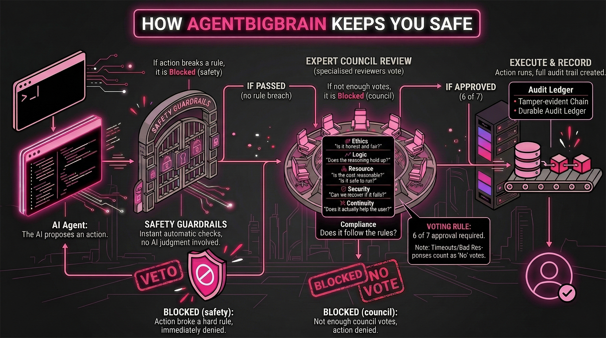
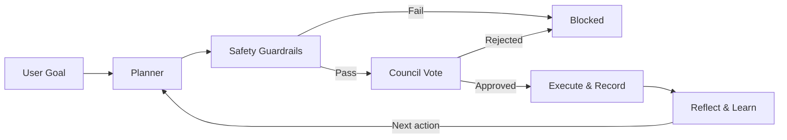

# 🧠 AgentBigBrain — Governed AI Assistant & Agent

<div align="center">
  
</div>

**A framework for AI assistants and agents where every action is checked, voted on, and recorded — before it runs.**

[](https://github.com/AgentBigBrain/AgentBigBrain/actions/workflows/ci.yml)
[](./LICENSE)
[](./tsconfig.json)
[](#zero-dependency-core)

---

## 🎯 What Is This?

AgentBigBrain is a framework for building AI assistants and autonomous agents you can actually trust.

Most agent frameworks let the AI decide what to do and hope for the best. AgentBigBrain takes a different approach: every action the AI proposes must pass through hard safety checks and a council of specialized reviewers before it's allowed to run. If anything looks wrong, the action is blocked — no exceptions, no overrides.

Think of it like checks and balances for AI. The AI plans. The system verifies. Only then does it act. Every approved action is recorded in a tamper-evident audit trail, so you never have to take the agent's word for it — you can verify exactly what happened and why.

Built in TypeScript with only **2 runtime dependencies** (`ws`, `onnxruntime-node`). Everything else runs on Node.js built-ins.

---

## ✨ Key Features

**🏛️ Governor Council** — Seven specialized reviewers (ethics, logic, resource, security, continuity, utility, compliance) vote on every sensitive action. Six out of seven must approve.

**🛡️ Safety Guardrails** — Hard rules that run before any voting. If the AI tries something dangerous — running unsafe code, touching protected files, exceeding budgets — it's blocked instantly. No debate, no AI judgment involved.

**🔗 Tamper-Evident Receipts** — Every approved action produces a cryptographic receipt. You don't have to trust the agent — you can verify.

**🧠 Six Governed Memory Systems** — Profile facts, episodic memory, governance memory, semantic memory, workflow learning, and continuity state (entity graph plus open loops). All governed, with private remembered-situation review controls.

**💬 Multi-Interface** — CLI, Telegram bot, Discord bot, and an HTTP federation protocol for agent-to-agent communication.

<a id="zero-dependency-core"></a>
**📦 Minimal Dependencies** — Only 2 runtime packages. No heavyweight SDKs. Crypto, HTTP, SQLite, and process control all use Node.js built-ins.

---

## 🧭 Design Philosophy & Deep Capabilities

### The model is treated as untrusted

AgentBigBrain does not treat model output as authority. The model proposes. The runtime decides.

That matters because every proposed action still has to survive:

- strict typed contracts
- deterministic safety rules
- governance review
- execution-time verification

The result is a simple design philosophy: intelligence can be flexible, but execution must be
bounded, auditable, and fail-closed.

### It can grow new tools under governance

The runtime can create and run governed skills. In practice, that means the agent can write a
useful tool for itself, validate it, and use it later without turning the system into an
unrestricted self-modifying loop.

This is not open-ended self-rewrite. It is bounded self-extension under policy, review, and audit.

### It remembers situations, not just facts

The memory model is designed to reduce the usual “start from scratch every time” feeling.

The runtime keeps:

- profile facts
- remembered situations and outcomes
- continuity state like open loops and entity links

That lets it resume relevant context across sessions, ask better follow-up questions, and revive an
older unresolved thread when it naturally comes up again, without stuffing full transcripts back
into every prompt.

### It produces high-signal execution data

Approved actions leave durable receipts and related runtime traces. Over time, that gives you a
cleaner record of what the agent actually proposed, what was allowed, what ran, and what happened
afterward.

That data is useful for:

- audits
- evaluations
- replay and regression testing
- future model-training or fine-tuning pipelines

---

## 🔄 How It Works

Every action follows the same path — no shortcuts, no exceptions:

<div align="center">
  
</div>

1. **🎯 Plan** — The AI reads your goal and proposes a concrete list of actions.
2. **🛡️ Check** — Each action runs through hard safety rules. Anything dangerous is blocked instantly, before any AI judgment is involved.
3. **🗳️ Vote** — The council of 7 specialized reviewers evaluates the action. Six of seven must approve. If any reviewer times out or returns a bad response, that counts as a "no."
4. **⚡ Execute & Record** — The action runs. A cryptographic receipt is appended to the tamper-evident audit chain.
5. **💡 Reflect** — The system analyzes what happened and stores useful lessons for next time.

<details>
<summary>Text-based flow diagram</summary>


</details>

---

## 📊 What Makes This Different

| | Typical Agent Frameworks | AgentBigBrain |
|---|---|---|
| Safety | Optional, bolted on later | **Built in from day one** — there is no bypass |
| Who decides safety? | The AI polices itself | **Hard rules run first**; the AI never controls its own safety checks |
| Audit trail | Logs, maybe | **Every action has a cryptographic receipt** |
| Memory | Basic retrieval stores | **Six governed memory systems** for profile facts, episodes, governance, semantic memory, workflow learning, and continuity state — with encryption, probing detection, and private remembered-situation review controls |
| Dependencies | Dozens of packages | **2 runtime dependencies** |
| When in doubt | Allow by default | **Block by default** — failing safe is always the answer |

---

## 🚀 Quickstart

> **Full setup guide:** [docs/SETUP.md](docs/SETUP.md)

### Prerequisites

- **Node.js 22.x** or later
- **npm**

### Install and Run

```bash
npm install
npm run build
npm test
npm run dev -- "summarize current repo status"
```

### Optional: Local Embeddings

Semantic memory uses a local ONNX model. Install it once:

```bash
npm run setup:embeddings
```

If you skip this step, set `BRAIN_ENABLE_EMBEDDINGS=false` to fall back to keyword-only retrieval.

### Configure

```bash
cp .env.example .env    # or: Copy-Item .env.example .env (PowerShell)
```

Edit `.env` with your API key and preferred settings. For local testing without an API key:

```env
BRAIN_MODEL_BACKEND=mock
BRAIN_RUNTIME_MODE=isolated
```

For the full configuration reference (model backends, shell profiles, interfaces, federation, and all environment variables), see **[docs/SETUP.md](docs/SETUP.md)**.

---

## 📝 Examples

### CLI

```bash
# Single governed task
npm run dev -- "summarize current repo status"

# Bounded autonomous loop
npm run dev -- --autonomous "stabilize runtime wiring plan execution"

# Daemon mode (requires additional env config — see SETUP.md)
npm run dev -- --daemon "continuously triage repository issues"
```

### Telegram / Discord

```bash
npm run dev:interface
```

Then use `/chat`, `/propose`, `/auto`, `/memory`, `/status`, and other slash commands. See **[docs/COMMAND_EXAMPLES.md](docs/COMMAND_EXAMPLES.md)** for the full command reference with examples.

### Federation (Agent-to-Agent)

```bash
npm run dev:federation
```

For federation setup and API usage, see **[docs/SETUP.md](docs/SETUP.md)**.

---

## ❓ FAQ

### What does AgentBigBrain do for an AI assistant or agent?

It gives your AI assistant or agent a plan-check-vote-execute loop. The assistant can read files, write files, run shell commands, send network requests, and more — but only after every proposed action passes safety checks and council review. Nothing runs without approval.

### Is this safe to use?

Safety is the core design principle. Every action is checked by hard rules first, then voted on by a council of 7 reviewers. The system is fail-closed: if anything goes wrong — a timeout, a bad response, a missing config — the default answer is "block." You can also run in mock mode (`BRAIN_MODEL_BACKEND=mock`) with no external API calls at all.

### What happens if the agent tries something dangerous?

It gets blocked. Hard safety rules run before any voting, and they catch things like unsafe code patterns, protected file access, and budget overruns. These rules are deterministic — the agent can't talk its way past them. If an action somehow passes the hard rules, the council can still reject it. If the council times out, the action is blocked. The system always defaults to "no."

### What are the 7 governors?

They're specialized AI reviewers, each looking at the action from a different angle:

| Governor | What they check |
|----------|----------------|
| **Ethics** | Is it honest and fair? |
| **Logic** | Does the reasoning hold up? |
| **Resource** | Is the cost reasonable? |
| **Security** | Is it safe to run? |
| **Continuity** | Can we recover if it fails? |
| **Utility** | Does it actually help the user? |
| **Compliance** | Does it follow the rules? |

Six of seven must approve for the action to proceed.

### What's the difference between fast path and escalation path?

Low-risk actions take the **fast path** — only the security governor votes, so they're quick. Higher-risk actions take the **escalation path** — the full council of 7 reviews them. The system decides which path automatically based on the action type.

### Can I use this with my own model?

Yes. Set `BRAIN_MODEL_BACKEND=openai` and configure `OPENAI_API_KEY`. You can point it at any OpenAI-compatible API (including local models) using `OPENAI_BASE_URL`. There's also an Ollama adapter for local models. See **[docs/SETUP.md](docs/SETUP.md)** for all model options.

### How do I connect it to Telegram or Discord?

Set `BRAIN_INTERFACE_PROVIDER` to `telegram`, `discord`, or `both`, add your bot token(s), and configure the username allowlist. Then run `npm run dev:interface`. Step-by-step instructions are in **[docs/SETUP.md](docs/SETUP.md)**.

### What are clones?

Clones are short-lived satellite identities the agent can spawn for bounded parallel work. They're not independent sub-agents — they stay under the main agent's governance and their outputs must pass merge checks before integration. Think of them as temporary helpers on a short leash, not autonomous workers.

### How do I know the agent isn't lying about what it did?

You don't have to take its word for it. Every approved action produces a cryptographic receipt containing output digests, vote records, and a hash-chained link to all prior receipts. You can verify the full chain at any time with `npm run audit:ledgers`.

### What are the evolutionary stages?

AgentBigBrain doesn't grant full autonomy all at once. It unlocks capabilities through version-gated stages, and each stage requires proven, auditable milestones before the next one activates. For example, Stage 6.75 adds user-facing approval flows, Stage 6.85 adds mission recovery, and Stage 6.86 adds multi-turn conversations. For the full architecture, see **[docs/ARCHITECTURE.md](docs/ARCHITECTURE.md)**.

---

## 🔧 Troubleshooting

Common issues and their fixes:

| Problem | Fix |
|---------|-----|
| `OPENAI_API_KEY` missing | Set the key in `.env`, or use `BRAIN_MODEL_BACKEND=mock` for local testing |
| Full-access mode fails at startup | Set `BRAIN_ALLOW_FULL_ACCESS=true` alongside `BRAIN_RUNTIME_MODE=full_access` |
| Daemon exits immediately | All three latches required: `BRAIN_ALLOW_DAEMON_MODE=true`, `BRAIN_MAX_AUTONOMOUS_ITERATIONS > 0`, `BRAIN_MAX_DAEMON_GOAL_ROLLOVERS > 0` |
| `GLOBAL_DEADLINE_EXCEEDED` | Increase `BRAIN_PER_TURN_DEADLINE_MS` (e.g., `120000` for heavy tasks) |
| Interface won't start | Check: `BRAIN_INTERFACE_PROVIDER`, `BRAIN_INTERFACE_SHARED_SECRET`, `BRAIN_INTERFACE_ALLOWED_USERNAMES`, and bot token(s) |

For the full error-code-to-env-variable map, see **[docs/ERROR_CODE_ENV_MAP.md](docs/ERROR_CODE_ENV_MAP.md)**.

---

## 🏗️ Architecture

| Layer | Directory | What It Does |
|---|---|---|
| **Core** | `src/core/` | Orchestrator, task runner, hard constraints, config, execution receipts |
| **Organs** | `src/organs/` | Cognitive modules — planner, executor, reflection, memory, classifiers |
| **Governors** | `src/governors/` | 7 council governors, code review gate, master vote aggregation |
| **Models** | `src/models/` | Provider adapters (OpenAI, Ollama, mock) behind a shared interface |
| **Interfaces** | `src/interfaces/` | Telegram, Discord, federation server, session management |
| **Tests** | `tests/` | 150+ test files covering every maturity stage |

**Entry point:** `src/index.ts` — **Composition root:** `src/core/buildBrain.ts`

Full architecture spec: **[docs/ARCHITECTURE.md](docs/ARCHITECTURE.md)**

---

## 🔒 Security

Report vulnerabilities privately to **security@michiganwebteam.com** or via [GitHub Security Advisories](https://github.com/AgentBigBrain/AgentBigBrain/security/advisories/new). Do not open public issues for security vulnerabilities. See [SECURITY.md](SECURITY.md).

## 🤝 Contributing and Support

- Contributing guide: [CONTRIBUTING.md](CONTRIBUTING.md)
- Code of Conduct: [CODE_OF_CONDUCT.md](CODE_OF_CONDUCT.md)
- Support channels: [SUPPORT.md](SUPPORT.md)
- Changelog: [CHANGELOG.md](CHANGELOG.md)

## License

Apache License, Version 2.0. See [LICENSE](LICENSE).

Copyright (c) 2026 Anthony J. Benacquisto. Part of the AgentBigBrain Trust Protocol. See [NOTICE](NOTICE).
