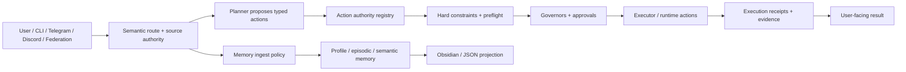

# AgentBigBrain

[](https://deepwiki.com/AgentBigBrain/AgentBigBrain)
[](https://github.com/AgentBigBrain/AgentBigBrain/actions/workflows/ci.yml)
[](./LICENSE)
[](./tsconfig.json)
[](./package.json)

Governance-first TypeScript AI agent runtime for semantic routing, governed execution, durable
memory, reusable skills, browser/process work, and receipt-backed automation.

AgentBigBrain is an open-source AI agent runtime for builders who want assistants that can do real
work without turning every decision into a prompt. Models interpret and propose. Typed contracts
decide authority. Deterministic runtime policy enforces safety. Receipts prove what happened.

It is designed for governed AI automation across CLI runs, bounded autonomous loops, Telegram and
Discord assistant interfaces, HTTP federation, local browser and process verification, durable
memory, Markdown skill-guided generation, Obsidian-readable AI memory projection, and multiple model
backends under one control model.

Start here:

- [Docs index](./docs/README.md)
- [Setup and environment wiring](./docs/SETUP.md)
- [Short architecture overview](./docs/ARCHITECTURE_OVERVIEW.md)
- [Architecture reference](./docs/ARCHITECTURE.md)
- [Concepts glossary](./docs/CONCEPTS.md)
- [Command examples](./docs/COMMAND_EXAMPLES.md)
- [Runtime error and env map](./docs/ERROR_CODE_ENV_MAP.md)

## Why AgentBigBrain exists

Most agent systems are good at proposing work. Fewer are good at proving that the work was safe,
allowed, and actually executed. AgentBigBrain is built around that gap.

The model stays flexible. The runtime stays strict.

AgentBigBrain is not a chatbot wrapper and it is not a loose shell around a model. It is a
governed AI agent runtime that can carry context across conversations, use reusable skills, work
with files and browsers, and produce reviewable evidence for risky or important actions.

## What makes it different

- **Semantic routing with typed authority**: fuzzy language becomes route metadata, memory
  candidates, or clarification state; it does not become permission by itself.
- **Governed tool execution**: file, shell, network, browser, process, skill, and memory actions
  pass through deterministic constraints and governance.
- **Receipt-backed truth**: final answers should be backed by execution receipts, browser/process
  evidence, policy reason codes, or memory provenance.
- **Durable memory with source policy**: profile memory, episodic memory, semantic memory, and
  workflow learning are separated by authority and purpose.
- **Skill-guided generation**: reusable Markdown skills guide the model without granting side
  effects or replacing safety policy.
- **Human-readable projection**: Obsidian and JSON mirrors expose memory, receipts, governance, and
  workflow evidence as read models, not truth sources.
- **Interface-ready runtime**: Telegram, Discord, CLI, and federation entrypoints share one governed
  runtime core.

## Architecture at a glance



The short version: models can interpret broadly, while the runtime acts through narrow contracts
and records proof for what happened.

## What AgentBigBrain does today

| Area | Capability |
|---|---|
| Agent runtime | Single task runs, bounded autonomous loops, guarded daemon mode |
| Interfaces | CLI, Telegram, Discord, authenticated federation |
| Planning | Model-planned typed actions with repair, constraints, and governance |
| Local execution | Files, shell, managed processes, localhost readiness, browser verification |
| Memory | Graph-backed profile memory, episodic memory, semantic memory, workflow learning |
| Skills | Markdown instruction skills and governed executable skills |
| Media | Images, voice notes, documents, and short video metadata/captions with source-labeled layers |
| Projection | Obsidian vault mirror and JSON mirror for reviewable memory/evidence |
| Backends | Mock, OpenAI API, Codex OAuth, Ollama, OpenAI-compatible endpoints |

At the npm runtime package level, the project depends on `ws` and `onnxruntime-node`. In practice,
the full runtime also depends on your chosen backend, auth state, and any optional services you
enable, such as Telegram, Discord, or Ollama.

What the runtime enforces:

- deterministic hard constraints before model judgment
- typed authority boundaries so lexical cues, media summaries, workflow hints, and projected notes
  can support a decision without becoming permission
- layered governance for risky actions
- proof gates for certain completion claims
- durable governance records and execution receipts
- bounded, privacy-aware memory and continuity
- governed local live runs instead of ad hoc shell behavior
- skill-guided generation, where reusable Markdown instructions guide the model but do not grant
  permission or replace governance

## Runtime modes

| Surface | Command | Purpose |
|---|---|---|
| Single task | `npm run dev -- "summarize current repo status"` | Run one governed task and exit |
| Autonomous loop | `npm run dev -- --autonomous "..."` | Run bounded iterations for one goal |
| Daemon mode | `npm run dev -- --daemon "..."` | Chain goals under explicit safeguards |
| Codex auth | `npm run dev -- auth codex status` | Inspect or manage local Codex login state |
| Interface runtime | `npm run dev:interface` | Start Telegram, Discord, or both |
| Federation runtime | `npm run dev:federation` | Start authenticated inbound federation handling |

`npm run dev:federation` starts the inbound HTTP surface. Outbound federation is separate. The
orchestrator can delegate a task to another agent before local planning when federation policy and
target config allow it.

Daemon mode is intentionally guarded. It will not start unless all of these are set:

```env
BRAIN_ALLOW_DAEMON_MODE=true
BRAIN_MAX_AUTONOMOUS_ITERATIONS=...
BRAIN_MAX_DAEMON_GOAL_ROLLOVERS=...
```

## Quickstart

### Prerequisites

- Node.js 22.x or later
- npm

### Install, build, and test

```bash
npm install
npm run build
npm test
```

### Create your local environment file

```bash
cp .env.example .env
```

For a dry-run starting point with no external model calls:

```env
BRAIN_MODEL_BACKEND=mock
BRAIN_RUNTIME_MODE=isolated
```

### Run the CLI

```bash
npm run dev -- "summarize current repo status"
npm run dev -- --autonomous "stabilize runtime wiring plan execution"
```

## Backends and auth

| Backend | `BRAIN_MODEL_BACKEND` | Best for | Minimum setup |
|---|---|---|---|
| Mock | `mock` | local dry runs and tests | none |
| OpenAI API | `openai_api` | hosted model access | `OPENAI_API_KEY` |
| Codex OAuth | `codex_oauth` | local Codex subscription-backed runs | local Codex login state |
| Ollama | `ollama` | local model serving | running Ollama server |

OpenAI-compatible endpoints can use `OPENAI_BASE_URL`. The `openai` alias maps to `openai_api`.

Codex auth commands:

```bash
npm run dev -- auth codex login
npm run dev -- auth codex status
npm run dev -- auth codex logout
```

Optional profile-aware login:

```bash
npm run dev -- auth codex login --profile work
npm run dev -- auth codex status --profile work
```

Optional embeddings:

```bash
npm run setup:embeddings
```

If you skip embeddings, set:

```env
BRAIN_ENABLE_EMBEDDINGS=false
```

## What gets checked before an action runs

The runtime path is ordered on purpose:

1. The planner proposes typed actions.
2. Preflight checks budget, deadlines, path rules, shell rules, stage rules, and idempotency.
3. Connector and network preflight checks approval scope for side-effecting egress when needed.
4. Governance runs through a reduced fast path for low-risk work or the full council for
   sensitive work.
5. A verification gate can block `respond` if the runtime does not have enough proof to claim the
   task is done.
6. Approved work executes through the executor or a governed runtime action.
7. Governance outcomes and execution receipts are written as durable evidence, including connector
   receipts for approved external writes.

That order is part of the runtime contract.

## Skill-guided generation

AgentBigBrain treats site, app, browser-recovery, and document-reading know-how as guidance, not as
hard-coded generators. Built-in Markdown skills live in
`src/organs/skillRegistry/builtinMarkdownSkills/`, and user-created skills live under
`runtime/skills`.

Markdown instruction skills are advisory planner context. They can tell the model how to approach a
static HTML page, a Next.js app, browser recovery, or generic document interpretation, but they do
not authorize side effects and they are not executable `run_skill` targets. The resulting actions
still pass through typed planning, hard constraints, governors, proof gates, and receipts.

User-created Markdown skills start as runtime files under `runtime/skills`. Explicit user-created
skills can become active immediately, while agent-suggested skills are recorded as reviewable drafts
until an operator approves them. Operators can update, approve, reject, or deprecate skills through
the governed skill lifecycle actions; inactive skills stay out of planner guidance and executable
skill runs.

This keeps generated work flexible without moving safety into prompts. Deterministic runtime code
may validate paths, normalize action shape, reopen exact artifacts, manage owned previews, and
verify proof. It should not synthesize creative site templates or framework source as a hidden
fallback.

## Interface runtime

The interface layer is not a thin wrapper around the CLI. It has its own session store, queueing,
worker lifecycle, draft flows, slash commands, memory review paths, and media ingress reduction.

Supported providers:

- Telegram
- Discord
- both in one shared runtime

Start it with:

```bash
npm run dev:interface
```

Telegram/Desktop live-smoke validation is documented in `docs/SETUP.md` for operator runs.

Common interface settings:

```env
BRAIN_INTERFACE_PROVIDER=telegram
BRAIN_INTERFACE_SHARED_SECRET=...
BRAIN_INTERFACE_ALLOWED_USERNAMES=...
```

Important defaults:

- interface-side autonomous execution is off by default
- Telegram and Discord can share one runtime core when both are enabled
- long-lived profile continuity across both providers still depends on profile memory being enabled
- the optional local intent model is separate from the main planner backend

Example local intent-model settings:

```env
BRAIN_LOCAL_INTENT_MODEL_ENABLED=true
BRAIN_LOCAL_INTENT_MODEL_PROVIDER=ollama
BRAIN_LOCAL_INTENT_MODEL_NAME=gemma4:latest
```

## Memory and continuity

AgentBigBrain uses separate memory systems with different jobs instead of pushing everything into
one growing prompt.

Profile memory is the long-lived personal-memory layer. It lives in an encrypted store and uses a
graph-backed model so the runtime can track people, claims, timing, and whether something is
current, historical, resolved, or conflicting.

Stage 6.86 continuity is different. It owns the live conversation stack, entity graph, open
loops, and pulse state for the active interaction. Its entity graph is deterministic-first, but it
also trims command-style glue and low-signal conversational residue before durable persistence and
supports bounded cleanup of older graph noise.

| Memory surface | Purpose |
|---|---|
| Profile memory graph | durable personal facts, relationships, and time-aware history |
| Episodic memory | remembered situations, outcomes, and follow-up context |
| Source Recall Archive | quoted evidence for what was said or seen, without truth or execution authority |
| Stage 6.86 continuity | conversation stack, entity graph, open loops, pulse state |
| Governance memory | reviewable governance outcomes |
| Semantic memory | lessons and concept-linked recall |
| Workflow learning | repeated execution patterns and judgment calibration |

Memory access is brokered. The runtime supports bounded review, correction, forgetting, and
continuity-linked recall instead of treating memory as write-only.

## External memory projection

The runtime can mirror canonical memory and evidence into external inspection targets without
making those targets the source of truth.

Current sink shape:

- Obsidian vault mirror for human-readable notes, Bases files, and optional asset copies
- JSON mirror sink for seam testing and non-Obsidian inspection

What gets mirrored:

- profile-memory entities, claims, and episodes
- Stage 6.86 continuity summaries and open loops
- governance decisions
- execution receipts
- workflow-learning summaries
- runtime-owned media artifacts and their derived meaning

How to read the mirror:

- entity notes are continuity notes first, not automatic truth records
- `Current Temporal Claims` are the durable profile-memory truth surface
- `interface:telegram:...` evidence refs are provenance pointers to observed turns, not raw chat logs acting as the database

The mirror is read-only first. Guarded write-back exists through structured review-action notes, so
fact corrections, episode changes, forgetting, and follow-up-loop creation still route through the
runtime's canonical mutation seams.

## Local live runs and proof

When policy allows it, the executor can:

- start managed processes
- prove localhost readiness
- verify a page in a real browser
- stop the process when the mission is complete

This is governed runtime behavior. It is not just free-form shell scripting.

## Useful commands

```bash
npm run check:repo
npm run audit:governors
npm run audit:claims
npm run audit:ledgers
npm run audit:traces
npm run entity-graph:prune-low-signal
npm run projection:export:obsidian
npm run projection:apply-review-actions
npm run projection:open:obsidian
```

The repository also includes stage-specific tests and evidence scripts for runtime maturity,
conversation behavior, live-run proof, and interface flows.

## Repository map

| Area | Directory | What lives there |
|---|---|---|
| Core runtime | `src/core/` | orchestrator, task runner, hard constraints, ledgers, media artifacts, projections, config |
| Organs | `src/organs/` | planner, executor, reflection, memory, language understanding |
| Governors | `src/governors/` | council members, vote aggregation, fail-closed governance |
| Models | `src/models/` | `mock`, `ollama`, `openai_api`, `codex_oauth` adapters |
| Interfaces | `src/interfaces/` | Telegram, Discord, conversation runtime, federation |
| Tests and evidence | `tests/`, `scripts/evidence/` | stage tests, live smokes, audits, evidence bundles |

## Documentation map

- [Docs index](./docs/README.md)
- [Architecture overview](./docs/ARCHITECTURE_OVERVIEW.md)
- [Concepts glossary](./docs/CONCEPTS.md)
- [Architecture reference](./docs/ARCHITECTURE.md)
- [Setup and environment wiring](./docs/SETUP.md)
- [Command examples](./docs/COMMAND_EXAMPLES.md)
- [Runtime error and env map](./docs/ERROR_CODE_ENV_MAP.md)
- [Contributing](./CONTRIBUTING.md)
- [Security](./SECURITY.md)
- [Support](./SUPPORT.md)
- [Changelog](./CHANGELOG.md)

## Security

Report vulnerabilities privately to [security@agentbigbrain.com](mailto:security@agentbigbrain.com)
or through [GitHub Security Advisories](https://github.com/AgentBigBrain/AgentBigBrain/security/advisories/new).
Do not open public issues for security reports.

## Maintainer

Maintained by [Anthony J. Benacquisto](https://github.com/flarewebdesign).

## License

Apache License 2.0. See [LICENSE](./LICENSE) and [NOTICE](./NOTICE).
