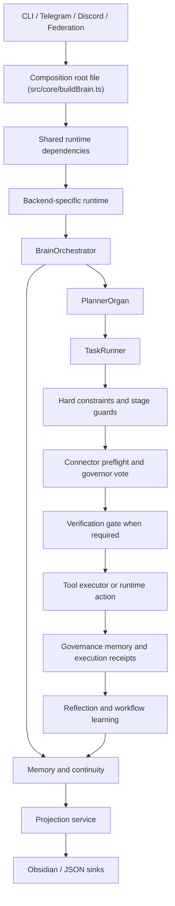

# AgentBigBrain Architecture

AgentBigBrain is a governance-first runtime for AI assistants and agents. The model can plan,
explain, and propose. The runtime decides whether anything is allowed to happen.

This document is the stable architectural reference for the current codebase. It describes how the
runtime is assembled, where the main responsibilities live, and which invariants the system keeps.

Operator references:

- setup and environment wiring: [SETUP.md](./SETUP.md)
- command and prompt examples: [COMMAND_EXAMPLES.md](./COMMAND_EXAMPLES.md)
- runtime reason and block codes: [ERROR_CODE_ENV_MAP.md](./ERROR_CODE_ENV_MAP.md)
- repository overview: [../README.md](../README.md)

## System intent

The runtime is built around four ideas:

- deterministic rules run before model judgment
- side effects require governance
- approved work produces durable audit artifacts
- memory and continuity stay bounded, privacy-aware, and reviewable

In practice, that means:

- planning is flexible
- execution is constrained
- failure is fail-closed
- claimed work must be backed by evidence

## Entry points and runtime modes

| Surface | File | Responsibility |
|---|---|---|
| CLI runtime | `src/index.ts` | runs one governed task, a bounded autonomous loop, guarded daemon mode, and Codex auth commands |
| Interface runtime | `src/interfaces/interfaceRuntime.ts` | starts Telegram and Discord gateways and routes accepted work into the orchestrator |
| Federation runtime | `src/interfaces/federationRuntime.ts` | starts authenticated inbound federation HTTP handling |

The CLI supports four operational modes:

| Mode | Description |
|---|---|
| `task` | run one governed task and exit |
| `autonomous` | run bounded iterations for one goal |
| `daemon` | chain goals with explicit latches and rollover limits |
| `auth` | manage Codex login state |

The CLI contract is strict by design:

- unknown flags are rejected
- empty goals are rejected
- auth subcommands are typed, not free-form
- daemon mode is blocked unless the operator sets explicit latches

Daemon mode requires:

```env
BRAIN_ALLOW_DAEMON_MODE=true
BRAIN_MAX_AUTONOMOUS_ITERATIONS=...
BRAIN_MAX_DAEMON_GOAL_ROLLOVERS=...
```

## Composition root and runtime assembly

The composition-root file is `src/core/buildBrain.ts`.

That file splits runtime construction into two layers:

1. `createSharedBrainRuntimeDependencies()` builds the process-wide runtime core:
   - stores and ledgers
   - executor
   - managed process registry
   - browser session registry
   - governors
   - memory surfaces
   - media artifact persistence
   - projection service and sink state
   - shared persistence

2. `buildBrainRuntimeFromEnvironment()` adds backend-specific layers on top of that shared core:
   - config
   - model client
   - planner
   - reflection
   - memory broker
   - orchestrator

3. `buildDefaultBrain()` preserves the simple single-backend path for callers that do not need
   per-session backend overrides.

This split matters. Long-lived runtimes such as Telegram and Discord can share one executor, one
process registry, one browser registry, and one ledger core while still selecting different
backend settings when needed.

## Topology



The important architectural point is that the orchestrator is not the whole runtime by itself. It
sits on top of shared stores, registries, and ledgers, and it delegates planning, execution,
memory brokerage, and reflection to focused subsystems.

## End-to-end task flow

`BrainOrchestrator.runTask()` is the main task entrypoint.

The runtime flow is:

1. Accept task input from the CLI, an interface gateway, or a federation caller.
2. Optionally attempt outbound federated delegation when that path is configured and allowed.
3. Load state, continuity, and memory context needed for planning.
4. Build a plan through `PlannerOrgan`.
5. Run each action through `TaskRunner`.
6. Persist governance outcomes and approved-action receipts.
7. Run reflection and update learning stores.
8. Return a result that describes what actually happened, not what the model hoped happened.

Inbound federation and outbound federation are separate surfaces. The federation runtime accepts
external work over HTTP. The orchestrator can also delegate work outward before local planning when
policy and target config allow it.

Within `TaskRunner`, the order of checks is intentionally strict:

1. deadline and spend checks
2. mission stop checks and idempotency protection
3. hard constraints and stage guards
4. network preflight, connector policy checks, and approval handling when relevant
5. code-review preflight for `create_skill` when relevant
6. fast-path or full-council governance
7. verification gate for certain completion claims
8. execution
9. governance log and execution receipt writes

That order is part of the architecture. Later layers do not override earlier deterministic blocks.

## Main control planes

### Orchestration plane

Main surfaces:

- `src/core/orchestrator.ts`
- `src/core/taskRunner.ts`
- `src/core/orchestration/`

This plane owns:

- task lifecycle
- bounded replanning
- per-action execution loops
- governance integration
- persistence and receipts
- trace-ready runtime state
- post-run learning updates

The orchestrator also exposes bounded review seams for continuity episodes, continuity facts,
remembered situations, remembered facts, managed process snapshots, and browser session snapshots.

### Planning plane

Main surfaces:

- `src/organs/planner.ts`
- `src/organs/plannerPolicy/`

The planner turns goals into typed actions. It does more than call a model once.

It also handles:

- planner failure fingerprints and cooldowns
- retrieval of relevant lessons
- workflow and judgment hints
- skill registry guidance from relevant Markdown instruction skills
- narrow deterministic recovery paths for exact owned resources
- repair of malformed or incomplete planner output
- response fallback when fail-closed repair still cannot produce executable work

The planner is flexible, but it is still not trusted. All plans are downstream inputs to stricter
runtime gates.

### Skill-guided generation model

Reusable generation know-how lives in the skill registry instead of hard-coded page or framework
generators. Built-in Markdown skills are source-controlled under
`src/organs/skillRegistry/builtinMarkdownSkills/`; user-created runtime skills live under
`runtime/skills`.

There are two distinct skill kinds:

- `markdown_instruction`: advisory planner guidance selected by request relevance. These skills can
  describe how to build a static page, a framework app, a Next.js route, a browser-recovery flow, or
  a document-reading pass. They are not executable and do not grant authorization.
- `executable_module`: governed runtime artifacts that can be invoked with `run_skill` after normal
  constraints and governance.

For generation work, the intended path is:

1. route the request into a typed build or recovery lane
2. attach build-format metadata and relevant Markdown guidance
3. let the model produce normal governed actions
4. validate, govern, execute, and verify those actions through the runtime

Deterministic policy may still validate package safety, normalize exact artifact paths, manage
owned processes, and require proof. It must not silently synthesize creative site templates,
framework scaffolds, generated source, or browser-open chains as a fallback.

### Deterministic safety plane

Main surfaces:

- `src/core/hardConstraints.ts`
- `src/core/orchestration/taskRunnerPreflight.ts`
- `src/core/stage6_85QualityGatePolicy.ts`
- `src/core/stage6_86/`

This plane runs before the main governance vote and owns non-negotiable rules such as:

- budget ceilings
- protected path boundaries
- shell and network execution guards
- stage-gated runtime actions
- localhost and live-verification rules
- identity and communication constraints
- completion-proof gates for certain `respond` actions

If this layer blocks an action, there is no later override.

### Governance plane

Main surfaces:

- `src/governors/defaultGovernors.ts`
- `src/governors/masterGovernor.ts`
- `src/governors/voteGate.ts`
- `src/core/orchestration/taskRunnerGovernance.ts`

The default council has seven focused governors:

- ethics
- logic
- resource
- security
- continuity
- utility
- compliance

Governance is layered:

- `create_skill` can trigger a code-review preflight before the main council vote
- low-risk work can use a reduced fast path
- sensitive work uses the full council

The vote gate is intentionally fail-closed. Timeouts, malformed votes, mismatched governor IDs,
and missing expected governors are normalized into rejection paths.

### Execution plane

Main surfaces:

- `src/organs/executor.ts`
- `src/organs/liveRun/`
- `src/core/stage6_86/`

The execution layer owns:

- standard tool actions
- shell and file operations
- managed-process lifecycle
- localhost readiness proof
- browser verification
- Stage 6.86 runtime actions such as bounded memory mutation and pulse emission

The executor is also where process and browser snapshot visibility comes from. Those snapshots are
surfaced back through the orchestrator and interface runtime for operator review.

## Interface and conversation runtime

Main surfaces:

- `src/interfaces/interfaceRuntime.ts`
- `src/interfaces/conversationManager.ts`
- `src/interfaces/conversationRuntime/`
- `src/interfaces/mediaRuntime/`
- `src/interfaces/userFacing/`

The interface plane is not a thin wrapper around the CLI.

It owns:

- Telegram and Discord transport handling
- per-session queueing
- worker lifecycle
- draft and approval flows
- slash-command routing
- user-facing language cleanup
- bounded proactive delivery
- memory review commands
- media ingest reduction into structured context

When both Telegram and Discord are enabled, they share one orchestrator-side runtime core. That
keeps session and execution state coherent across providers. Long-lived profile continuity across
both providers still depends on profile memory being enabled.

`ConversationManager` is the main interface ingress coordinator.

It owns:

- session load and save
- command vs natural-language classification
- immediate acknowledgment timing
- queueing and worker startup
- proposal and approval state
- turn history limits
- follow-up classification state
- pulse state updates

Important defaults:

- interface-side autonomous execution is off by default
- the default local intent confidence threshold is `0.85`
- conversations are bounded by turn and context limits

That design keeps the interface conversational without letting the front door silently become an
unrestricted autonomy surface.

## Memory and continuity model

Main surfaces:

- `src/organs/memoryBroker.ts`
- `src/organs/memoryContext/`
- `src/core/profileMemoryStore.ts`
- `src/core/profileMemoryRuntime/`
- `src/core/stage6_86/`
- `src/core/memoryAccessAudit.ts`

Memory is brokered. Raw stores are not dumped straight into prompts.

Profile memory is the long-lived personal-memory layer. Inside the encrypted store, the runtime
keeps a graph-backed truth model for observations, claims, events, and entity references. That
lets it reason about who a claim is about, when it was observed, what is true now, what used to be
true, and what is still unresolved or conflicting.

Stage 6.86 continuity is the live runtime layer for the active conversation. It owns the
conversation stack, entity graph, open loops, pulse state, and runtime-action continuity. It can
query profile memory for bounded recall, but it is a separate system with a different job. Its
entity graph is deterministic-first, trims low-signal conversational residue before durable
persistence, and can run a bounded cleanup pass over older graph noise when operators need to
repair an already-polluted continuity snapshot.

Stable fact and episode review surfaces still exist for operators and user-facing review, but they
are bounded reads over the encrypted store rather than the internal truth owner.

The main memory surfaces are:

| Memory system | Main job |
|---|---|
| Profile memory graph | durable personal facts, relationships, and time-aware history |
| Episodic memory | remembered situations, outcomes, and follow-up state |
| Stage 6.86 continuity | active conversation stack, entity graph, open loops, pulse state |
| Governance memory | append-only governance outcomes |
| Semantic memory | reusable lessons and concept-linked recall |
| Workflow learning | repeated workflow patterns and judgment calibration |

The broker also supports:

- bounded temporal and continuity-linked recall for planning
- memory access audit logging
- probing detection
- remembered-situation review
- fact review
- correction and forgetting paths

## External projection model

Main surfaces:

- `src/core/projections/`
- `src/core/mediaArtifactStore.ts`
- `src/tools/exportObsidianProjection.ts`
- `src/tools/applyObsidianReviewActions.ts`
- `src/tools/openObsidianProjection.ts`

The projection layer is downstream of the canonical stores. It is not a second memory system and it
is not a truth owner.

Current responsibilities:

- build full snapshots from profile memory, Stage 6.86 runtime state, the entity graph,
  governance memory, execution receipts, workflow learning, and media artifacts
- fan out those snapshots or incremental change sets to external sinks
- keep a read-only first Obsidian vault mirror with stable note paths, `.base` files, and optional
  asset copies
- preserve a generic sink seam so non-Obsidian targets can stay possible

Projected entity notes are continuity surfaces, not automatic truth records. The durable truth
surface is the graph-backed profile-memory claim layer. That is why an entity note can show
continuity evidence and uncertain co-mentions while still showing no current temporal claims.

Guarded write-back exists, but it stays narrow. Obsidian review-action notes can request fact
correction, fact forgetting, episode resolve or forget, and follow-up-loop creation. Those actions
still route through the canonical profile-memory and Stage 6.86 mutation seams.

## Reflection and learning plane

Main surfaces:

- `src/organs/reflection.ts`
- `src/core/workflowLearningStore.ts`
- `src/core/judgmentPatterns.ts`
- `src/core/distillerLedger.ts`

Reflection is post-run learning, not open-ended self-rewrite.

The reflection path can:

- extract lessons from failure
- extract lessons and near-misses from success
- normalize and classify lesson signals
- write lessons to semantic memory
- route clone-attributed lessons through a distiller merge decision and ledger before commit

Reflection is best-effort by design. A failed reflection write does not invalidate the governed
run that already happened.

## Media ingest model

Main surfaces:

- `src/interfaces/mediaRuntime/`
- `src/organs/mediaUnderstanding/`
- `src/organs/memoryContext/`
- `src/core/mediaArtifactStore.ts`

The runtime stays text-first internally. Media is interpreted once, then reduced to structured
context with explicit limits.

Current model:

1. transport accepts the media attachment
2. media runtime downloads and normalizes metadata
3. media understanding produces summary text, optional OCR or transcript, confidence, source
   notes, and entity hints
4. memory brokerage decides whether any of that belongs in continuity or remembered situations
5. the rest of the runtime sees structured context, not raw media blobs

Raw uploads now also have a runtime-owned artifact lane. The transport and download path can persist
stable artifact identity, checksum, owned asset path, provider metadata, and derived meaning before
that information is reduced into profile memory or continuity. That gives operators a durable
inspection surface for the original upload and the runtime's interpretation of it.

Current capability shape:

- images can use vision-capable model paths when configured
- voice notes can use transcription when configured
- video stays on file metadata and caption context rather than full clip analysis

That choice is deliberate. It keeps the system honest about what it actually understood.

## Local live-run model

Main surfaces:

- `src/organs/liveRun/startProcessHandler.ts`
- `src/organs/liveRun/checkProcessHandler.ts`
- `src/organs/liveRun/stopProcessHandler.ts`
- `src/organs/liveRun/probeHttpHandler.ts`
- `src/organs/liveRun/probePortHandler.ts`
- `src/organs/liveRun/browserVerificationHandler.ts`

The intended sequence is:

1. start a managed process
2. prove localhost readiness
3. optionally verify the page in a real browser
4. stop the process if the mission calls for a finite flow

These are governed capabilities. They are not treated as loose shell shortcuts.

## Network and connector governance

Main surfaces:

- `src/core/orchestration/taskRunnerNetworkPreflight.ts`
- `src/core/orchestration/taskRunnerExecution.ts`

Network writes have their own preflight layer.

That layer can enforce:

- endpoint normalization
- allowed egress checks
- connector policy consistency
- approval scope validation
- connector receipt seeding

For side-effecting egress, the runtime can require explicit approval material. If the required
approval ID is missing or out of scope, the action is blocked before execution.

Approved connector writes can also produce receipt data that ties the action to the connector,
operation class, request payload, response metadata, external identifiers, and mission context.
That gives operators a durable record of what the runtime was allowed to do and what outside
object it touched.

## Persistence and audit artifacts

Default local artifacts include:

| Domain | Default path | Main surface |
|---|---|---|
| Task state | `runtime/state.json` | `src/core/stateStore.ts` |
| Governance log | `runtime/governance_memory.json` | `src/core/governanceMemory.ts` |
| Execution receipts | `runtime/execution_receipts.json` | `src/core/executionReceipts.ts` |
| Semantic memory | `runtime/semantic_memory.json` | `src/core/semanticMemory.ts` |
| Encrypted profile memory | `runtime/profile_memory.secure.json` | `src/core/profileMemoryStore.ts` |
| Interface sessions | `runtime/interface_sessions.json` | `src/interfaces/sessionStore.ts` |
| Memory access audit | `runtime/memory_access_log.json` | `src/core/memoryAccessAudit.ts` |
| Stage 6.86 runtime state | `runtime/stage6_86_runtime_state.json` | `src/core/stage6_86/runtimeState.ts` |
| SQLite ledger backend | `runtime/ledgers.sqlite` | shared sqlite-backed stores |

Approved work leaves two durable proof surfaces:

- governance outcomes
- execution receipts

That split matters. One record explains what the runtime allowed. The other records what actually
executed.

## Model and backend layer

Main surfaces:

- `src/models/createModelClient.ts`
- `src/models/backendConfig.ts`
- `src/models/openaiModelClient.ts`
- `src/models/ollamaModelClient.ts`
- `src/models/mockModelClient.ts`
- `src/models/codex/`

Supported backends:

| Backend | Purpose |
|---|---|
| `mock` | deterministic dry-run and testing path |
| `ollama` | local model serving |
| `openai_api` | OpenAI-compatible API access |
| `codex_oauth` | Codex subscription-backed local auth path |

Notes that matter operationally:

- the `openai` alias still maps to `openai_api`
- Codex OAuth is a separate backend, not just another auth mode on the OpenAI client
- local intent interpretation stays a separate optional path and does not automatically switch
  when the main planner backend changes
- model output is always treated as untrusted until it is normalized and validated

## Extension path

If you add a new action type or runtime capability, the safe order is:

1. add or update typed contracts
2. extend hard-constraint coverage
3. extend governance coverage
4. add preflight and approval behavior where needed
5. route execution in the right runtime surface
6. emit durable evidence or receipts
7. update subsystem docs and targeted tests

That order is part of how the codebase stays governable.

## Architectural invariants

These are the core invariants:

- no side effect runs before deterministic hard constraints
- no sensitive side effect runs without governance
- no completion claim should overstate what the runtime proved
- approved work must leave durable evidence
- memory injection must stay bounded and privacy-aware
- interface conversation state must stay bounded and recoverable
- shared runtime state should stay coherent even when provider backends vary

In one sentence:

AgentBigBrain lets the model think broadly, but it forces the runtime to act narrowly, audibly,
and truthfully.
