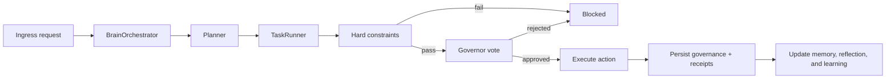

# AgentBigBrain Architecture

AgentBigBrain is a governance-first runtime for AI assistants and agents. The model can plan,
explain, and propose. The runtime decides whether anything is allowed to happen.

This document is the stable architectural reference. It describes how the current runtime is put
together, where major responsibilities live, and which invariants the system preserves.

Operator references:
- setup and environment wiring: [docs/SETUP.md](SETUP.md)
- command and prompt examples: [docs/COMMAND_EXAMPLES.md](COMMAND_EXAMPLES.md)
- runtime reason and block codes: [docs/ERROR_CODE_ENV_MAP.md](ERROR_CODE_ENV_MAP.md)

## 1) System Intent

The runtime is built around four ideas:

- deterministic rules run before model judgment
- side effects require governance
- approved work produces durable audit artifacts
- memory and continuity stay bounded, privacy-aware, and reviewable

In practice, that means:

- planning is flexible
- execution is constrained
- failure is fail-closed
- claimed work must be backed by evidence

## 2) Top-Level Runtime Surfaces

### Entry Points

| Surface | File | Responsibility |
|---|---|---|
| CLI runtime | `src/index.ts` | Runs one governed task, an autonomous loop, or daemon mode |
| Interface runtime | `src/interfaces/interfaceRuntime.ts` | Starts Telegram and Discord gateways and routes accepted work into the orchestrator |
| Federation runtime | `src/interfaces/federationRuntime.ts` | Starts authenticated inbound federation HTTP handling |

### Composition Root

`src/core/buildBrain.ts` is the composition root. It wires:

- environment/config loading
- model client selection
- organs and governors
- persistence stores
- memory surfaces
- orchestrator runtime

That file is intentionally the place where major subsystems come together.

## 3) Main Runtime Flow

Per approved action, the runtime stays deterministic:

1. task-level deadline and budget guards
2. hard constraints
3. optional code-review preflight for `create_skill`
4. fast-path or escalation governance vote
5. execution-claim verification gates where needed
6. execution
7. append governance event
8. append approved-action receipt

## 4) Control Planes

### Planning Plane

Main surface:
- `src/organs/planner.ts`

The planner turns user goals into typed action plans. The planner can repair malformed model output,
normalize provider quirks, and bias planning toward finite proof when the request is execution-heavy.

Canonical planner-policy ownership lives under:
- `src/organs/plannerPolicy/`

### Deterministic Safety Plane

Main surface:
- `src/core/hardConstraints.ts`

This plane runs before any governor vote. It owns the non-negotiable rules:

- budget ceilings
- path boundaries
- shell and network execution guards
- localhost/live-verification constraints
- communication and identity rules
- skill-creation schema checks
- Stage 6.86 runtime action validation

If this layer blocks an action, there is no later override.

### Governance Plane

Main surfaces:
- `src/governors/defaultGovernors.ts`
- `src/governors/masterGovernor.ts`
- `src/governors/voteGate.ts`

The runtime uses seven main governors:

- ethics
- logic
- resource
- security
- continuity
- utility
- compliance

There is also a code-review preflight surface for `create_skill`.

Fast path and escalation path are resolved by execution mode. Low-risk work can stay on a narrow
path; sensitive work uses the full council.

### Execution Plane

Main surfaces:
- `src/organs/executor.ts`
- `src/organs/liveRun/`
- `src/core/stage6_86/`

The execution layer owns:

- standard tool actions
- managed-process lifecycle
- localhost readiness proof
- browser/UI verification
- Stage 6.86 runtime actions like `memory_mutation` and `pulse_emit`

### Orchestration Plane

Main surfaces:
- `src/core/orchestrator.ts`
- `src/core/taskRunner.ts`
- `src/core/orchestration/`

This layer owns:

- task lifecycle
- bounded replanning
- per-action execution loops
- persistence and receipts
- reflection and learning updates
- trace-ready runtime state

## 5) Memory Model

AgentBigBrain does not have one giant memory bucket. It has six governed memory systems with
different jobs.

| Memory system | Main surfaces | What it stores |
|---|---|---|
| Profile facts | `src/core/profileMemoryStore.ts`, `src/core/profileMemoryRuntime/` | Durable user facts and preferences |
| Episodic memory | `src/core/profileMemoryRuntime/profileMemoryEpisode*.ts` | Remembered situations, outcomes, and follow-up state |
| Continuity state | `src/core/stage6_86/` | Conversation stack, open loops, and entity graph continuity |
| Governance memory | `src/core/governanceMemory.ts` | Append-only governance outcomes |
| Semantic memory | `src/core/semanticMemory.ts` | Reusable lessons and concept-linked recall |
| Workflow learning | `src/core/workflowLearningStore.ts`, `src/core/judgmentPatterns.ts` | Repeated workflow patterns and judgment calibration |

### Memory Access Rules

Memory is not injected into the planner or interface directly from raw stores. Memory access is
brokered through:

- `src/organs/memoryBroker.ts`
- `src/organs/memoryContext/`
- `src/core/memoryAccessAudit.ts`

Key invariants:

- sensitive reads stay fail-closed
- profile and episode reads remain bounded
- probing detection can suppress memory injection
- remembered situations can be reviewed privately through `/memory`, but not dumped unboundedly

### Human-Centric Continuity

The current runtime supports:

- bounded in-conversation contextual recall
- episodic linking to entities and open loops
- bounded cross-memory synthesis for recall and planner context
- human-centric proactive qualification and cooldown logic

Main supporting surfaces:
- `src/interfaces/conversationRuntime/contextualRecall.ts`
- `src/organs/languageUnderstanding/`
- `src/organs/memorySynthesis/`
- `src/interfaces/proactiveRuntime/`

## 6) Interface and Conversation Model

Main surfaces:
- `src/interfaces/interfaceRuntime.ts`
- `src/interfaces/conversationManager.ts`
- `src/interfaces/conversationRuntime/`
- `src/interfaces/transportRuntime/`
- `src/interfaces/mediaRuntime/`
- `src/interfaces/userFacing/`

The interface stack is designed so transport handling, conversation state, and user-facing language
stay separate.

### What the interface layer owns

- Telegram and Discord ingress/egress
- per-session queueing and worker execution
- slash-command routing
- draft/approve flows
- autonomous loop delivery
- bounded proactive check-ins
- bounded contextual recall inside active conversations
- private remembered-situation review and correction through `/memory`

### User-facing language model

The interface layer aims to be:

- plain-English first
- truthful about what executed
- non-robotic
- bounded in proactive behavior

That is why user-facing rendering now separates:

- execution summaries
- block summaries
- stop summaries
- language cleanup and phrasing normalization

Main surface:
- `src/interfaces/userFacing/`

## 6A) Media Ingest Model

Main surfaces:
- `src/interfaces/mediaRuntime/`
- `src/organs/mediaUnderstanding/`
- `src/organs/memoryContext/`

The runtime stays text-first internally, so media is interpreted once and then reduced to structured context with clear limits.

Current model:

1. transport parses the inbound media attachment
2. media runtime downloads and normalizes metadata
3. media understanding produces a short summary, optional OCR/transcript, confidence, source note, and entity hints
4. memory brokerage decides whether any of that belongs in continuity or remembered situations
5. the rest of the conversation runtime sees structured context, not raw media blobs

Current capability limits:

- images can use a vision-capable OpenAI model when configured
- voice notes can use the transcription endpoint when configured
- short videos currently use file metadata and captions

Why video is still fallback-only:

- there is no dedicated clip-analysis path in the current runtime
- frame sampling, cost, latency, and truthfulness controls are not mature enough yet
- the runtime currently limits video interpretation to file metadata and captions

That choice is deliberate. It keeps the system honest while still letting video participate in intent clarification and continuity context.

## 7) Live-Run and Verification Model

The runtime supports real local live-run workflows when policy allows them.

Main surfaces:
- `src/organs/liveRun/startProcessHandler.ts`
- `src/organs/liveRun/checkProcessHandler.ts`
- `src/organs/liveRun/stopProcessHandler.ts`
- `src/organs/liveRun/probeHttpHandler.ts`
- `src/organs/liveRun/probePortHandler.ts`
- `src/organs/liveRun/browserVerificationHandler.ts`

The intended sequence is:

1. start a managed process
2. prove localhost readiness
3. optionally verify the page in a real browser
4. stop the managed process if the mission requires a finite flow

The runtime treats these as governed capabilities, not ad hoc shell tricks.

## 8) Persistence and Audit Artifacts

Default local artifacts include:

| Domain | Default path | Main surface |
|---|---|---|
| Task state | `runtime/state.json` | `src/core/stateStore.ts` |
| Governance log | `runtime/governance_memory.json` | `src/core/governanceMemory.ts` |
| Execution receipts | `runtime/execution_receipts.json` | `src/core/executionReceipts.ts` |
| Semantic memory | `runtime/semantic_memory.json` | `src/core/semanticMemory.ts` |
| Encrypted profile memory | `runtime/profile_memory.secure.json` | `src/core/profileMemoryStore.ts` |
| Interface sessions | `runtime/interface_sessions.json` | `src/interfaces/sessionStore.ts` |
| Memory access audit | `runtime/memory_access_log.json` | `src/core/memoryAccessAudit.ts` |
| Stage 6.86 runtime state | `runtime/stage6_86_runtime_state.json` | `src/core/stage6_86/runtimeState.ts` |
| SQLite ledger backend | `runtime/ledgers.sqlite` | shared sqlite-backed stores |

Approved actions also produce hash-linked execution receipts. Those receipts are the durable proof
surface for “what actually ran.”

## 9) Model Layer

Main surfaces:
- `src/models/createModelClient.ts`
- `src/models/openaiModelClient.ts`
- `src/models/mockModelClient.ts`
- `src/models/schema/`
- `src/models/openai/`

Supported backends:

- mock
- OpenAI-compatible
- Ollama

OpenAI backend note:

- the OpenAI runtime resolves model aliases to provider ids, selects a transport (`chat/completions`
  or `responses`) per model-family compatibility policy, and normalizes both transport shapes back
  into the same structured-output validation path
- current operator guidance is centered on the GPT-4.1 and GPT-5.x families, with `chat/completions`
  preferred for `gpt-4.1*`, `responses` preferred for `gpt-5*`, and explicit lower-latency
  reasoning settings applied for GPT-5-family autonomous runs

The runtime treats model output as untrusted until it is normalized and validated.

Media note:

- image understanding depends on a vision-capable model path
- voice-note understanding depends on a transcription-capable model path
- video is currently transport-plus-fallback, not full multimodal clip reasoning

## 10) Extension Points

If you add a new action type or runtime capability, the safe path is:

1. add or update typed contracts
2. extend hard-constraint coverage
3. extend governance coverage
4. route execution in the correct runtime surface
5. emit durable evidence or receipts as needed
6. update subsystem READMEs
7. add targeted tests and, if relevant, smoke evidence

## 11) Architectural Invariants

These are the big ones:

- no side effect runs before deterministic hard constraints
- no sensitive side effect runs without governance
- approved work must leave durable evidence
- memory injection must stay bounded and privacy-aware
- user-facing language should not overclaim what happened
- stable entrypoints can stay thin, but canonical ownership should live in focused subsystems

That is the architecture in one sentence:

AgentBigBrain lets the model think broadly, but it forces the runtime to act narrowly, audibly, and
truthfully.
