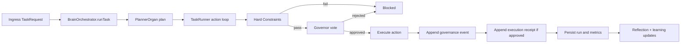

# AgentBigBrain Architecture

## 1) System Intent
AgentBigBrain is a governance-first agent runtime.

Think of it as air-traffic control for autonomous actions:
- planner proposes flights,
- hard constraints clear (or deny) the runway,
- governors vote on takeoff,
- executor runs approved work,
- receipts and traces provide the flight recorder.

Core design goals:
- deterministic safety boundaries before model judgment
- explicit governance for all side effects
- fail-closed behavior on malformed/timeout/missing control signals
- local-first, auditable runtime state

Operator troubleshooting reference:
- `docs/ERROR_CODE_ENV_MAP.md` (maps high-signal runtime/reason codes to env controls)

## 2) Runtime Topology

### Entry Points
| Surface | File | Responsibility |
|---|---|---|
| CLI runtime | `src/index.ts` | Runs one task, autonomous loop, or daemon loop |
| Interface runtime | `src/interfaces/interfaceRuntime.ts` | Runs Telegram/Discord gateways and routes chat jobs into orchestrator |
| Federation server runtime | `src/interfaces/federationRuntime.ts` | Runs authenticated inbound federation HTTP server |

### Composition Root
`src/core/buildBrain.ts` wires:
- config (`createBrainConfigFromEnv`)
- model client (`createModelClientFromEnv`)
- organs (planner, executor, memory broker, reflection)
- governors + master governor
- stores (state, governance memory, receipts, profile, workflow/judgment learning)
- orchestrator (`BrainOrchestrator`)

## 3) Control Planes

### Planning Plane
- `src/organs/planner.ts`
- Produces structured action plans from model output.
- Injects deterministic environment guidance (platform/shell/invocation/limits).
- Includes repair/retry and normalization logic for brittle provider payloads.

### Safety Plane (Deterministic)
- `src/core/hardConstraints.ts`
- Runs before any governance vote.
- Enforces non-negotiable policy (cost ceilings, path policy, immutable targets, shell/network guards, communication identity/data rules, Stage 6.86 action schemas).

### Governance Plane
- Voting: `src/governors/voteGate.ts`
- Aggregation: `src/governors/masterGovernor.ts`
- Per-action loop: `src/core/taskRunner.ts`

Governor set:
- Full council (7): `ethics`, `logic`, `resource`, `security`, `continuity`, `utility`, `compliance`
- Preflight-only governor (1): `codeReview` for `create_skill`

Operationally:
- There are 8 governor lenses in code.
- Escalation council voting is 6-of-7 by default (`supermajorityThreshold = 6`).
- Fast path defaults to `security` only (`fastPathGovernorIds = ["security"]`).

### Execution Plane
- Standard actions: `src/organs/executor.ts`
- Stage 6.86 actions (`memory_mutation`, `pulse_emit`): `src/core/stage6_86RuntimeActions.ts` via `TaskRunner`
- Receipts: `src/core/executionReceipts.ts`

### Orchestration Plane
- `src/core/orchestrator.ts`
- Owns task lifecycle, bounded replanning, persistence, reflection, and tracing.

## 4) End-to-End Runtime Flow

Per-action order in `TaskRunner` is deterministic:
1. runtime guards (deadline, idempotency, mission stop limits, model-spend guard)
   - deadline guard is configurable through `BRAIN_PER_TURN_DEADLINE_MS` (default `20000`)
2. hard constraints
3. `create_skill` code-review preflight (when applicable)
4. council vote (fast or escalation path)
5. respond verification gate (claim-sensitive prompts)
6. execution
7. governance-memory append
8. approved-action receipt append

If an attempt is governance-blocked and retry budget remains, orchestrator replans with typed feedback.

## 5) Governance Model Details

### Fast Path vs Escalation Path
Execution mode is resolved in `src/core/executionMode.ts`.

Default escalation action types:
- `delete_file`
- `self_modify`
- `network_write`
- `shell_command`
- `start_process`
- `check_process`
- `stop_process`
- `probe_port`
- `probe_http`
- `verify_browser`
- `create_skill`
- `memory_mutation`
- `pulse_emit`

Everything else defaults to fast path unless configured otherwise.

### Fail-Closed Voting
`runCouncilVote(...)` denies safely on:
- governor timeout/failure
- malformed vote payload
- missing expected governors

No decision, malformed decision, or empty required governor set also blocks execution.

## 6) Hard Constraint Boundary
`evaluateHardConstraints(...)` enforces deterministic policy before governance.

Major categories:
- budget policy (`maxEstimatedCostUsd`, cumulative action cost, cumulative model spend guard in runner)
- filesystem path policy (sandbox + protected paths + immutable target protections)
- shell policy (profile match, command length, timeout bounds, cwd policy, dangerous-command patterns)
- local readiness/browser-verification policy (loopback-only host/url validation and bounded probe/browser timeouts)
- communication policy (identity impersonation denied, personal-data approval required)
- dynamic skill policy (name/code validation, executable export requirement, unsafe pattern denial)
- Stage 6.86 schema policy (`memory_mutation` store/operation/payload and `pulse_emit` kind validation)

## 7) Action Execution Layer

### Standard Tool Execution (`ToolExecutorOrgan`)
Handles:
- `respond`
- file I/O actions
- `read_file` returns bounded preview content with deterministic truncation metadata (`readFileTotalChars`, `readFileReturnedChars`, `readFileTruncated`)
- `create_skill` / `run_skill` under `runtime/skills/` (`.js` primary runtime artifact, `.ts` compatibility fallback during migration window)
- `network_write` (simulated unless real network enabled)
- `shell_command` (simulated unless real shell enabled)
- `start_process` / `check_process` / `stop_process` for lease-based managed-process lifecycle control
- `probe_port` / `probe_http` for loopback-local readiness proof
- `verify_browser` for optional loopback-local browser/UI proof when Playwright is installed locally (for example `npm install --no-save playwright` then `npx playwright install chromium`)
- typed execution outcomes (`success | blocked | failed`) with deterministic runtime failure codes consumed by `TaskRunner`

Real shell execution uses explicit `spawn(executable, args)` from resolved shell profile, records bounded telemetry digests, and now observes propagated abort signals so autonomous `/stop` can terminate the active shell child instead of waiting for the next loop boundary.
Managed-process execution reuses the same shell-policy guardrails, but tracks a lease id plus lifecycle metadata (`PROCESS_STARTED`, `PROCESS_STILL_RUNNING`, `PROCESS_STOPPED`) so higher layers can reason about long-running sessions without faking exit-based completion. Local readiness probes (`PROCESS_READY`, `PROCESS_NOT_READY`) provide finite loopback proof for port/http availability after a live run starts, and `verify_browser` adds page-level proof for explicit homepage/UI verification requests when a local Playwright runtime is available.

### Stage 6.86 Runtime Actions
`memory_mutation` and `pulse_emit` do not execute in executor.
They run in `Stage686RuntimeActionEngine`, with durable adapters and deterministic receipt-linked mutation behavior.

### Execution Receipts
`ExecutionReceiptStore` appends receipts only for approved actions.

Each receipt includes:
- output digest
- vote digest
- metadata digest
- prior hash link (`priorReceiptHash`)
- current `receiptHash`

This yields a tamper-evident receipt chain for approved execution history.

## 8) Data Plane and Persistence

Default local artifacts:
| Domain | Default Path | Module |
|---|---|---|
| Task runs + aggregate metrics | `runtime/state.json` | `src/core/stateStore.ts` |
| Governance decision log | `runtime/governance_memory.json` | `src/core/governanceMemory.ts` |
| Execution receipt chain | `runtime/execution_receipts.json` | `src/core/executionReceipts.ts` |
| Semantic lessons | `runtime/semantic_memory.json` | `src/core/semanticMemory.ts` |
| Personality profile | `runtime/personality_profile.json` | `src/core/personalityStore.ts` |
| Encrypted profile memory | `runtime/profile_memory.secure.json` | `src/core/profileMemoryStore.ts` |
| Interface session state | `runtime/interface_sessions.json` | `src/interfaces/sessionStore.ts` |
| Trace log (optional) | `runtime/runtime_trace.jsonl` | `src/core/runtimeTraceLogger.ts` |
| SQLite ledger backend | `runtime/ledgers.sqlite` | shared across stores when enabled |

Most stores support JSON and/or SQLite backends with deterministic lock + atomic-write patterns where applicable.

## 9) Model Layer
`createModelClientFromEnv()` selects one backend:
- `mock`
- `openai`
- `ollama`

Model calls remain behind `ModelClient`.
Structured outputs are normalized and validated before entering planner/governor/orchestrator paths.

## 10) Interfaces and Federation

### Chat Interfaces
`src/interfaces/interfaceRuntime.ts` starts Telegram/Discord gateways with:
- auth and allowlist checks
- replay/rate-limit controls
- per-session queue worker (`ConversationManager`)
- shared orchestrator path for all accepted tasks
- deterministic user-facing rendering that leads with plain-English execution state (`Executed`, `Guidance only`, `Blocked`) while preserving typed technical reason codes in technical/debug surfaces
- when no custom `respond` action exists, successful executed work now renders human-first direct outcomes (for example created file, ran command, started process) instead of generic `Completed task with ...` telemetry
- default `/status` output is human-first and summarizes what is running, queued, or waiting for approval; explicit `/status debug` is required to see ack/final-delivery lifecycle internals
- deterministic routing-map intent hints (`RoutingMapV1`) injected into conversation-aware execution input:
  - generic execution-style build/create prompts (for example React app creation on Desktop) classify to `BUILD_SCAFFOLD` execution surface
  - explanation-only build prompts stay outside execution-surface routing to reduce over-classification
- planner prompts for execution-style build goals bias finite proof steps (`scaffold -> edit -> install -> build -> finite verification`) before long-running `npm start`/`npm run dev`-style live verification, and user-facing no-op output explains that live verification remains unproven instead of overclaiming success
  - generic build prompts can unlock finite shell planning without requiring explicit shell-keyword phrasing
  - managed-process planning stays narrower and only opens when the prompt clearly asks to run or verify a live app/session
  - inspection-only build plans (`read_file`, `list_directory`, `check_process`, `stop_process` without a concrete build/proof step) are repaired once and then fail closed
  - live-verification build prompts must include at least one live-proof action (`start_process`, `probe_port`, `probe_http`, or `verify_browser`)
  - explicit tool-like autonomous subtasks (`start_process ...`, `check_process ...`, `probe_http ...`, `probe_port ...`, `verify_browser ...`) are treated as matching-action requests, so the planner repairs or rejects unrelated drift instead of silently swapping in other actions
  - explicit homepage/browser/UI verification prompts can add `verify_browser` after localhost readiness is proven, but the runtime will fail closed if no local Playwright runtime is installed
- `verify_browser` runs a local Playwright-backed Chromium session in headless mode by default, so browser proof is real even when no visible window opens; set `BRAIN_BROWSER_VERIFY_VISIBLE=true` or `BRAIN_BROWSER_VERIFY_HEADLESS=false` to run the same proof in a visible local Chromium window
  - autonomous browser/UI verification goals can retry once with finite local Playwright install steps (`npm install --no-save playwright`, `npx playwright install chromium`) when `verify_browser` returns `BROWSER_VERIFY_RUNTIME_UNAVAILABLE` and policy still allows shell execution
- if governance/runtime blocks the remaining localhost proof steps for an autonomous live-verification goal, the loop stops with a plain explanation instead of repeating manual-check or shell-Playwright fallback subtasks
- loopback-local proof actions (`probe_port`, `probe_http`, `verify_browser`) and bounded managed-process lifecycle actions (`start_process`, `check_process`, `stop_process`) bypass model-advisory vetoes after deterministic localhost/live-run validation, so localhost/browser proof follows deterministic policy instead of model drift
- `start_process` performs a loopback-port preflight for explicit local-server ports, so polluted ports fail fast with typed metadata instead of being reported as healthy starts
- for explicit browser/UI verification goals, readiness is satisfied by actual HTTP/browser reachability rather than a bare port-open check, so the loop does not treat TCP accept alone as page-ready proof
- when a live-run goal explicitly asks for a finite flow or process shutdown, autonomous completion requires stop-proof before the loop can claim success
- when `start_process` succeeds but localhost proof still returns `PROCESS_NOT_READY`, the autonomous loop routes the next step through `check_process` lease inspection before retrying readiness
- when a loopback port is already occupied and the user did not explicitly require that port, the autonomous loop can restart the same local server on a suggested free localhost port before continuing readiness or browser proof
- explicit homepage/browser/UI verification prompts fail closed if the repaired plan still omits `verify_browser`
- if shell/process policy blocks a live-run build step, user-facing block rendering explains that the app was not started or verified and points to finite build proof or manual proof paths
  - respond-only build plans are repaired once and then fail closed if no executable non-respond action is produced
  - explicit missing-skill requests now fail deterministically at the hard-constraint boundary with `RUN_SKILL_ARTIFACT_MISSING`, so Telegram/Discord do not drift between governance-block phrasing and executor-failure phrasing for the same missing artifact
- autonomous progress delivery is transport-aware:
  - edit/stream-capable transports update a single progress message when possible
  - non-edit transports fall back to bounded discrete progress sends
  - progress and stop summaries now render human-first wording instead of leading with raw autonomous reason-code prefixes in normal chat flow
- autonomous cancellation now propagates through loop -> orchestrator -> task runner -> executor for active real shell steps, so `/stop` can interrupt the currently running shell child during autonomous execution
- advanced cross-provider UX regression gate: `npm run test:interface:advanced_live_smoke` runs adversarial Telegram+Discord prompt suites and emits `runtime/evidence/interface_advanced_live_smoke_report.json` with per-provider parity diagnostics
- real-provider transport smoke gate: `npm run test:interface:real_provider_live_smoke` runs live Telegram/Discord outbound delivery (no fetch stubs) and emits `runtime/evidence/interface_real_provider_live_smoke_report.json`; execution is fail-closed unless `BRAIN_INTERFACE_REAL_LIVE_SMOKE_CONFIRM=true`
- managed-process runtime smoke gate: `npm run test:runtime:managed_process_live_smoke` runs a real loopback process under `start_process -> probe_port/probe_http -> verify_browser -> stop_process` and emits `runtime/evidence/managed_process_live_smoke_report.json`; browser verification passes either by real Playwright proof or by a truthful `BROWSER_VERIFY_RUNTIME_UNAVAILABLE` fallback when Playwright is not installed locally

### Federation
- Inbound server: `src/interfaces/federationRuntime.ts` + `FederatedHttpServer`
- Outbound delegation: explicit tag only (`[federate:<agentId> quote=<usd>] ...`) via `src/core/federatedOutboundDelegation.ts`

Both paths remain governed by orchestrator policy.

## 11) Autonomy and Clone Model

### Autonomous Loop
`src/core/agentLoop.ts` runs bounded iterations for:
- autonomous mode
- daemon mode (with explicit safety latches and rollover limits)
- deterministic completion gate for execution-style missions: no `Goal Met` until mission-level approved real side-effect evidence exists (`read_file`/`list_directory` and simulated outcomes are excluded)
- deterministic mission contract checks before completion:
  - explicit-path missions require target-path touch evidence (`AUTONOMOUS_EXECUTION_STYLE_TARGET_PATH_EVIDENCE_REQUIRED`)
  - customization-heavy missions require artifact-mutation evidence from explicit typed mutation actions (shell-command text is excluded from mutation proof) (`AUTONOMOUS_EXECUTION_STYLE_MUTATION_EVIDENCE_REQUIRED`)
- deterministic side-effect-aware stall abort for execution-style respond-only loops (`reasonCode=AUTONOMOUS_EXECUTION_STYLE_STALLED_NO_SIDE_EFFECT`)
- deterministic task-step failure aborts: loop task-execution exceptions are converted to typed aborted reasons (`reasonCode=AUTONOMOUS_TASK_EXECUTION_FAILED`) rather than bubbling as generic interface failures
- stall-abort threshold is operator-configurable via `BRAIN_AUTONOMOUS_MAX_CONSECUTIVE_NO_PROGRESS` (default `3`)

### Clones Are Not Sub-Agents
`src/core/satelliteClone.ts` provides governed satellite primitives:
- deterministic spawn policy (count/depth/budget)
- role overlays (`creative`, `researcher`, `critic`, `builder`)
- direct satellite-to-satellite channel denial (isolation broker)
- merge-decision contracts with explicit rejection attribution

Important scope note:
- clones are bounded satellite identities inside policy envelopes, not independent unrestricted agents
- current production wiring uses clone-governed merge attribution in reflection/distiller flows; spawn/isolation primitives are present as governed runtime building blocks

## 12) Extension Points

To extend the system safely:
- add a new action type in `src/core/types.ts`
- add deterministic constraints in `src/core/hardConstraints.ts`
- route execution in `TaskRunner` and/or `ToolExecutorOrgan`
- ensure governance coverage (fast/escalation policy)
- persist required evidence/metadata (governance event + receipt semantics)
- add tests under `tests/` for runtime path behavior

## 13) Architectural Invariant
No action reaches side effects without passing:
1. deterministic hard constraints
2. governance decision path
3. runtime execution policies
4. durable audit artifacts

That invariant is the architecture.
