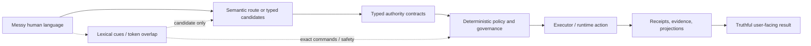
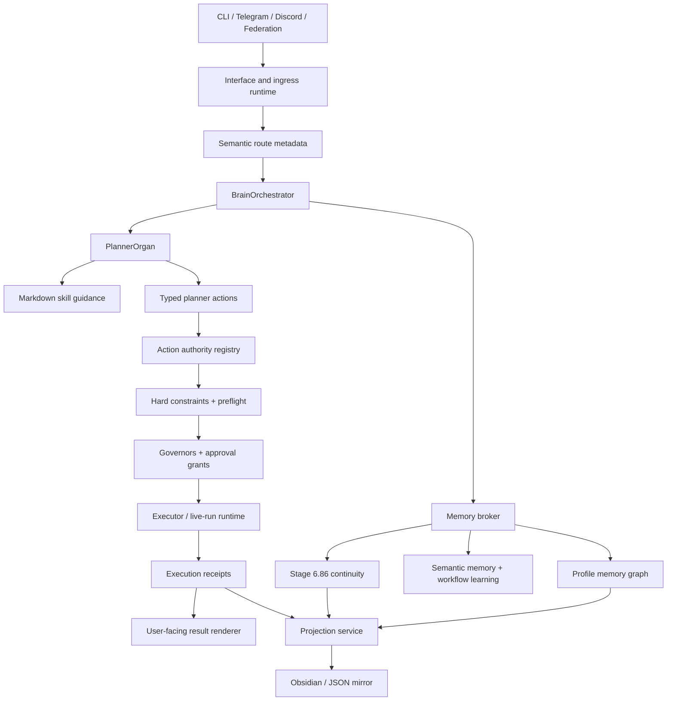
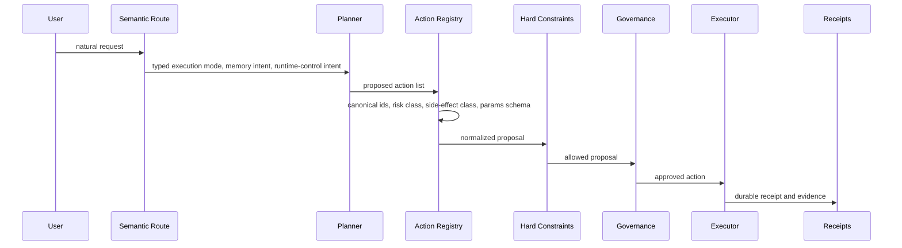
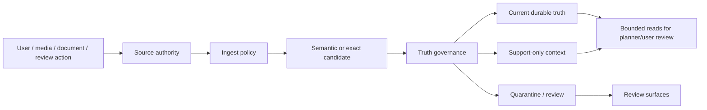
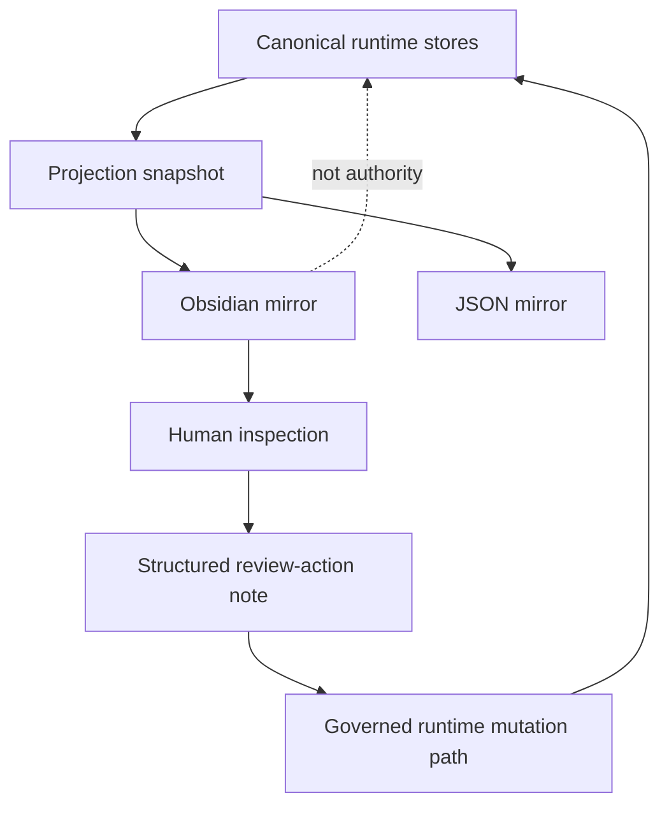

# AgentBigBrain Architecture Overview

This page is the short visual overview. The full architecture reference lives in
[ARCHITECTURE.md](./ARCHITECTURE.md).

## Core idea

AgentBigBrain separates four responsibilities that many agent systems collapse:

1. **Meaning**: what the user probably intends.
2. **Authority**: what the runtime is allowed to do.
3. **Execution**: what actually ran.
4. **Proof**: what can be claimed afterward.

## Runtime topology

## Action authority path

## Memory authority path

## Projection model

Projection is not memory authority. It is a review surface. Write-back happens only through
structured review actions.

## What stays deterministic

- exact commands
- exact paths, URLs, ports, ids, leases, and env vars
- schemas and manifests
- protected-path checks
- shell, network, browser, process, and approval gates
- active prompt option ids
- receipts and proof parsers
- redaction and sensitive scans

## What should be semantic or typed

- messy user intent
- relationship state
- identity updates
- memory writes
- workflow continuation
- skill selection
- media/document meaning
- mission completion claims
- proactive follow-up intent

## Invariant

> The model can think broadly. The runtime acts narrowly, audibly, and truthfully.
